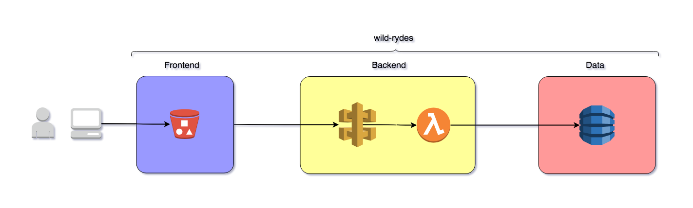

# Serverless Quick Start

In this module you'll be introduced to a basic serverless monolithic three tier web application. What we'll deploy and work with in this module is a simpler version of the Wild Rydes tech stack. The purpose of this is to more easilly understand how serverless architecture works without the added complexity that microservices introduce.

## Goals and Objectives:

**Objectives:**
* Understand the basics of a serverless system
  * What one looks like
  * How it functions
* Become familiar with Serverless Framework for system deployment and management
  * Use the most commonly used commands of Serverless Framework.

**Goals:**
* Deploy a serverless application
* Monitor application functionality

## Tech Stack

This is the wild Rydes tech stack we'll work with. It's a three tier architecture composed of:

* S3 hosted frontend
* API Gateway + Lambda backend
* DynamoDB data layer



The frontend is static HTML, JavaScript, CSS, and images stored in an S3 bucket. S3 acts as a webserver serving up this content to a web client. When a ride request is made, the web client makes a request to an API Gateway endpoint. The request to that endpoint triggers the `RequestRide` Lambda function which requests a ride from DynamoDB and returns the information to the web client and that information is then rendered on the page.

## Instructions

### 1. Clone wild-rydes
Clone the _wild-rydes_ application from GitHub that we'll deploying.

```
$ git clone https://github.com/ServerlessOpsIO/wild-rydes.git
$ git checkout quick-start
```

<details>
<summary><strong>Output</strong></summary>
<p>

```
$ git clone https://github.com/ServerlessOpsIO/wild-rydes.git
Cloning into 'wild-rydes'...
remote: Counting objects: 157, done.
remote: Total 157 (delta 0), reused 0 (delta 0), pack-reused 157
Receiving objects: 100% (157/157), 9.46 MiB | 2.56 MiB/s, done.
Resolving deltas: 100% (31/31), done.

$ git checkout quick-start
Switched to branch 'master'
```
</p>
</details>

### 2. Deploy Application

Deploy the application using Serverless Framework.

To start, install the Serverless Framework plugins used by this service. Plugins are configured in two places. First in the _plugins_ section of the _serverless.yml_ file and second in the _package.json_ file. The configuration in the _serverless.yml_ file loads the plugins at Serverless Framework runtime. The _package.json_ file handles plugin installation.

```
$ cd wild-rydes
$ npm install
```
<details>
<summary><strong>Output</strong></summary>
<p>

```
added 70 packages from 104 contributors and audited 97 packages in 4.691s
found 0 vulnerabilities
```
</p>
</details>

Now deploy the application using Serverless Framework.

```
$ serverless deploy -v
```
<details>
<summary><strong>Output</strong></summary>
<p>

```
Serverless: Installing requirements of requirements.txt in .serverless...
Serverless: Packaging service...
Serverless: Excluding development dependencies...
Serverless: Injecting required Python packages to package...
Serverless: Creating Stack...
Serverless: Checking Stack create progress...
CloudFormation - CREATE_IN_PROGRESS - AWS::CloudFormation::Stack - wild-rydes-dev
CloudFormation - CREATE_IN_PROGRESS - AWS::S3::Bucket - ServerlessDeploymentBucket
CloudFormation - CREATE_IN_PROGRESS - AWS::S3::Bucket - ServerlessDeploymentBucket
CloudFormation - CREATE_COMPLETE - AWS::S3::Bucket - ServerlessDeploymentBucket
CloudFormation - CREATE_COMPLETE - AWS::CloudFormation::Stack - wild-rydes-dev
Serverless: Stack create finished...
Serverless: Uploading CloudFormation file to S3...
Serverless: Uploading artifacts...
Serverless: Uploading service .zip file to S3 (11.45 MB)...
Serverless: Validating template...
Serverless: Updating Stack...
Serverless: Checking Stack update progress...
CloudFormation - UPDATE_IN_PROGRESS - AWS::CloudFormation::Stack - wild-rydes-dev

<SNIP>

CloudFormation - UPDATE_COMPLETE_CLEANUP_IN_PROGRESS - AWS::CloudFormation::Stack - wild-rydes-dev
CloudFormation - UPDATE_COMPLETE - AWS::CloudFormation::Stack - wild-rydes-dev
Serverless: Stack update finished...
Service Information
service: wild-rydes
stage: dev
region: us-east-1
stack: wild-rydes-dev
api keys:
  None
endpoints:
  POST - https://a0wh3ig8vh.execute-api.us-east-1.amazonaws.com/dev/ride
functions:
  RequestRide: wild-rydes-dev-RequestRide
  LoadTable: wild-rydes-dev-LoadTable
  StaticSiteConfig: wild-rydes-dev-StaticSiteConfig

Stack Outputs
RequestRideLambdaFunctionQualifiedArn: arn:aws:lambda:us-east-1:144121712529:function:wild-rydes-dev-RequestRide:9
StaticSiteConfigLambdaFunctionQualifiedArn: arn:aws:lambda:us-east-1:144121712529:function:wild-rydes-dev-StaticSiteConfig:9
LoadTableLambdaFunctionQualifiedArn: arn:aws:lambda:us-east-1:144121712529:function:wild-rydes-dev-LoadTable:9
StaticSiteS3BucketName: wild-rydes-dev.dev.training.serverlessops.io
StaticSiteS3BucketWebsiteURL: http://wild-rydes-dev.dev.training.serverlessops.io
ServiceEndpoint: https://a0wh3ig8vh.execute-api.us-east-1.amazonaws.com/dev
ServerlessDeploymentBucketName: wild-rydes-dev-serverlessdeploymentbucket-wl3p6ysx2dye

S3 Sync: Syncing directories and S3 prefixes...
...........
S3 Sync: Synced.
```
</p>
</details>

### 3. Use Application

Navigate to the newly deployed application. In the output of the previous step, look for the _StaticSiteS3BucketWebsiteURL_ in _Stack Outputs_. This is the URL of the newly deployed application.  Navigate to it in a web browser.


Use the application and request a ride.

### 4. Tail application logs

Tail the application logs. Serverless Framework's `logs` command will poll and dump the RequestRide function's logs from CloudWatch to the terminal window.

Start by getting the functions in the application stack using Serverless Framework's `info` command.

```
$ sls info
```

<details>
<summary><strong>Output</strong></summary>
<p>

```
Service Information
service: wild-rydes
stage: dev
region: us-east-1
stack: wild-rydes-dev
api keys:
  None
endpoints:
  POST - https://a0wh3ig8vh.execute-api.us-east-1.amazonaws.com/dev/ride
functions:
  RequestRide: wild-rydes-dev-RequestRide
  LoadTable: wild-rydes-dev-LoadTable
  StaticSiteConfig: wild-rydes-dev-StaticSiteConfig
```
</p>
</details>

The function's name is _RequestRide_. We'll ignore LoadTable and StaticSiteConfig for now.

Begin tailing the `RequestRide` logs. This will show the log output from usage of the application in the previous step.

```
$ sls logs -f RequestRide -t
```

<details>
<summary><strong>Output</strong></summary>
<p>

```
2018-08-20 12:09:06.145 (-04:00)                [INFO]  2018-08-20T16:09:06.145ZSTART RequestId: 5c6c0221-a493-11e8-88e8-cd6d1f1b5e45 Version: $LATEST
2018-08-20 12:09:06.199 (-04:00)        5c6c0221-a493-11e8-88e8-cd6d1f1b5e45    [INFO]  Request: {"resource": "/ride", "path": "/ride", "httpMethod": "POST", "headers": {"Accept": "*/*", "Accept-Encoding": "gzip, deflate, br", "Accept-Language": "en-US,en;q=0.9", "CloudFront-Forwarded-Proto": "https", "CloudFront-Is-Desktop-Viewer": "true", "CloudFront-Is-Mobile-Viewer": "false", "CloudFront-Is-SmartTV-Viewer": "false", "CloudFront-Is-Tablet-Viewer": "false", "CloudFront-Viewer-Country": "US", "content-type": "application/json", "Host": "a0wh3ig8vh.execute-api.us-east-1.amazonaws.com", "origin": "http://wild-rydes-dev.dev.training.serverlessops.io", "Referer": "http://wild-rydes-dev.dev.training.serverlessops.io/ride.html", "User-Agent": "Mozilla/5.0 (Macintosh; Intel Mac OS X 10_13_6) AppleWebKit/537.36 (KHTML, like Gecko) Chrome/68.0.3440.106 Safari/537.36", "Via": "2.0 83d82856eafc6ceb7ba06a257022fa7c.cloudfront.net (CloudFront)", "X-Amz-Cf-Id": "RJLS5Ymq-ucDHUUNnkqL98NGHLhaLMnz9nT9L4n9E3Pp9GTHolb8DA==", "X-Amzn-Trace-Id": "Root=1-5b7ae7a1-8b57b88c497a27d840f08ffc", "X-Forwarded-For": "73.17.175.174, 52.46.29.64", "X-Forwarded-Port": "443", "X-Forwarded-Proto": "https"}, "queryStringParameters": null, "pathParameters": null, "stageVariables": null, "requestContext": {"resourceId": "eznzv3", "resourcePath": "/ride", "httpMethod": "POST", "extendedRequestId": "L7khMHvjIAMFsMQ=", "requestTime": "20/Aug/2018:16:09:05 +0000", "path": "/dev/ride", "accountId": "144121712529", "protocol": "HTTP/1.1", "stage": "dev", "requestTimeEpoch": 1534781345249, "requestId": "5c6b65a9-a493-11e8-bb26-4769c4cfde0e", "identity": {"cognitoIdentityPoolId": null, "accountId": null, "cognitoIdentityId": null, "caller": null, "sourceIp": "73.17.175.174", "accessKey": null, "cognitoAuthenticationType": null, "cognitoAuthenticationProvider": null, "userArn": null, "userAgent": "Mozilla/5.0 (Macintosh; Intel Mac OS X 10_13_6) AppleWebKit/537.36 (KHTML, like Gecko) Chrome/68.0.3440.106 Safari/537.36", "user": null}, "apiId": "a0wh3ig8vh"}, "body": "{\"PickupLocation\":{\"Latitude\":42.36317996431076,\"Longitude\":-71.05193588435529}}", "isBase64Encoded": false}
2018-08-20 12:09:06.259 (-04:00)        5c6c0221-a493-11e8-88e8-cd6d1f1b5e45    [INFO]  Starting new HTTPS connection (1): dynamodb.us-east-1.amazonaws.com
2018-08-20 12:09:06.414 (-04:00)        5c6c0221-a493-11e8-88e8-cd6d1f1b5e45    [INFO]  Response: {"statusCode": 201, "body": "{\"RideId\": \"5cfc9954-a493-11e8-a910-425746ae81de\", \"Unicorn\": {\"Name\": \"Bucephalus\", \"Color\": \"Golden\"}, \"RequestTime\": \"2018-08-20 16:09:06.200610\"}", "headers": {"Access-Control-Allow-Origin": "*"}}
END RequestId: 5c6c0221-a493-11e8-88e8-cd6d1f1b5e45
REPORT RequestId: 5c6c0221-a493-11e8-88e8-cd6d1f1b5e45  Duration: 214.69 ms     Billed Duration: 300 ms         Memory Size: 128 MB     Max Memory Used: 41 MB
```
</p>
</details>

If you received the error `No existing streams for the function` then either you did not request a ride in the previous step or logs have been delayed in reaching CloudWatch.
```
$ sls logs -f RequestRide -t

  Serverless Error ---------------------------------------

  No existing streams for the function

  Get Support --------------------------------------------
     Docs:          docs.serverless.com
     Bugs:          github.com/serverless/serverless/issues
     Issues:        forum.serverless.com

  Your Environment Information -----------------------------
     OS:                     darwin
     Node Version:           8.9.2
     Serverless Version:     1.30.1
```

### 5. Invoke function

Invoke the ``RequestRide` function without going through the application frontend or API Gateway. The file _tests/events/request-ride-event.json_ is a mock API Gateway event that resembles the data that would be passed by API GAteway to the Lambda function.


```
$ sls invoke -f RequestRide -p tests/events/request-ride-event.json
```

<details>
<summary><strong>Output</strong></summary>
<p>
```json
{
    "statusCode": 201,
    "body": "{\"RideId\": \"30c565ea-a494-11e8-a910-425746ae81de\", \"Unicorn\": {\"Name\": \"Shadowfax\", \"Color\": \"White\"}, \"RequestTime\": \"2018-08-20 16:15:01.515825\"}",
    "headers": {
        "Access-Control-Allow-Origin": "*"
    }
}
```
</p>
</details>

### 5. Remove Application (After answering questions)

After you've answered the questions, remove the application.

```
$ serverless remove -v
```

## Questions

### 1. Serverless Framework Plugins

Q: Where are Serverless Framework plugins configured?

Q: Explain the purpose of each Serverless Framework plugin

### 2. Serverless Framework commands.

Q: What are each of the Serverless Framework commands and how are they used?

* deploy
* info
* logs
* remove

### 3. Event logs

Q. What is the _RequestRide_ invocation event? (Find one in the logs.)

Q. What is the _RequestRide_ response? (Find one in the logs.)
