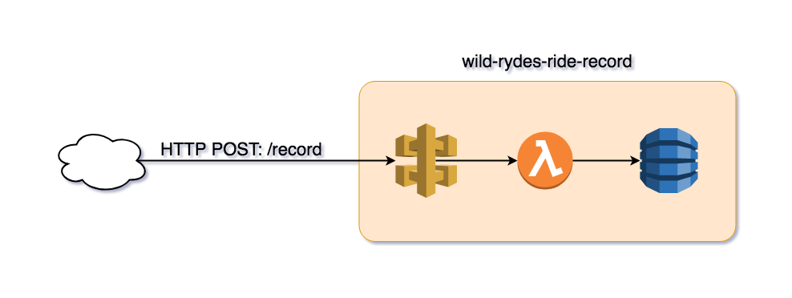

# Building A New Service

In this module you'll create a new serverless service from start to finish.

## Goals and Objectives:

**Objectives:**
* Apply the lessons of the past modules to create a new service

**Goals:**
* Build and deploy a new service

## Feature Request
The Wild Rydes application dispatches rides but never records the rides dispatched. You'll create a new service that records rides requested.



The new service will be a RESTful API using API Gateway and AWS Lambda. Data sent via an HTTP POST request to the `/record` endpoint will be written to a DynamoDB table. Below is an example of the data in the web request to the new service. It has a unique `RideId`, the time of the request, and information about the unicorn dispatched to pickup the requester.

```
{
  'RequestTime': '2018-08-20 16:15:01.515825',
  'RideId': '30c565ea-a494-11e8-a910-425746ae81de',
  'Unicorn': {
    'Color': 'White',
    'Name': 'Shadowfax'
  }
}
```

## Instructions

### 1. Create new project

#### Initialize new project
Initialize a new project using Serverless Framework. Serverless Framework requires a template for creating a new project. While you can use one of the built in templates, we've provided our own for this workshop that will be helpful if you are new to Serverless Framework or CloudFormation.

```
$ cd $WORKSPACE
$ sls create -n wild-rydes-ryde-record -p wild-rydes-ride-record -u https://github.com/ServerlessOpsIO/wild-rydes-ride-record-template
```
<details>
<summary><strong>output</strong></summary>
<p>

```
Serverless: Generating boilerplate...
Serverless: Downloading and installing "wild-rydes-ride-record-template"...
Serverless: Successfully installed "wild-rydes-ride-record"
```
</p>
</details>

#### Install Serverless Framework plugins and application dependencies
Now change into the newly created project and install the Serverless Framework plugins by running `npm install`. Because we're writing our function in Python we use a plugin called _serverless-python-requirements_ to bundle our function's module dependencies.
```
$ cd wild-rydes-ride-record
$ npm install
```
<!-- pyenv is not yet working in our container
Next, initialize the Python virtualenv and install module dependencies by running `npm run setup`. Our template we use has a setup run target in the `package.json` file to run the appropriate commands for you.
```
$ npm run setup
```
-->
Now examine the newly created _serverless.yml_ file in your editor.
<details>
<summary><strong>serverless.yml file</strong></summary>
<p>

```yaml

# This is the name of service we'll be deploying. You'll see it in the AWS
# Cloudfromation stack name.
service: wild-rydes-ride-record

#
plugins:
  - serverless-python-requirements

# Reuasable values and or plugin configuration.
custom:


# Serverless platform configuration.
#
# This service will be deployed to AWS and use the python 3.6 runtime.
provider:
  name: aws
  runtime: python3.6
  stage: "${opt:stage, env:SLS_STAGE, 'dev'}"
  profile: "${opt:aws-profile, env:AWS_PROFILE, env:AWS_DEFAULT_PROFILE, 'default'}"
  environment:
    LOG_LEVEL: "${env:LOG_LEVEL, 'INFO'}"


# Lambda functions are configured here.
functions:
  PutRideRecord:
    handler: handlers/put_ride_record.handler
    description: "Create Ride Record In Table"
    memorySize: 128
    timeout: 30


# Addtional service resources and configuration.
resources:
  # Additional AWS resources , e.g. DynamoDB tables, S3 Buckets, etc, are
  # configured here. For AWS, this is just CloudFormation configuration.
  Resources:


  # Configures CloudFormation stack outputs. These are often useful for
  # reference by other stacks.
  Outputs:

```
</p>
</details>

### 2. Write serverless.yml file

#### Add DynamoDB Table
Add a DynamoDB table to the project's _serverless.yml_ file. Your table should use the `RideId` of the JSON document accepted by the API endpoint as a unique hash key. Add the table in the section of the _serverless.yml_ where additional AWS resources go.

<details>
<summary><strong>Hint</strong></summary>
<p>
If you're familiar with CloudFormation, you can reference the documentation here:

* [CloudFormation AWS::DynamoDB::Table](https://docs.aws.amazon.com/AWSCloudFormation/latest/UserGuide/aws-resource-dynamodb-table.html)
</p>
</details>

<details>
<summary><strong>Answer</strong></summary>
<p>

```yaml
custom:
  # Add the key below to this section of the file.
  ddb_table_hash_key: 'RideId'

```

```yaml
resources:
  Resources:
    RideRecordTable:
      Type: AWS::DynamoDB::Table
      Properties:
        AttributeDefinitions:
          - AttributeName: ${self:custom.ddb_table_hash_key}
            AttributeType: S
        KeySchema:
          - AttributeName: ${self:custom.ddb_table_hash_key}
            KeyType: HASH
        ProvisionedThroughput:
          ReadCapacityUnits: 5
          WriteCapacityUnits: 5
```
</p>
</details>

#### Add Function

Add the configuration for the Lambda function. The function is triggered by an HTTP POST request to the `/record` endpoint. The function will need permission to write to the DynamoDB table and the function will need to know the name of the DynamoDB table. _(You can pass the DynanmoDB table name to the Lambda function as an environmental variable.)_

<details>
<summary><strong>Hint</strong></summary>
<p>

The following Serverless Framework docs will help:

* [IAM role statements](https://serverless.com/framework/docs/providers/aws/guide/iam/)
    * [DynamoDB IAM permissions](https://docs.aws.amazon.com/amazondynamodb/latest/developerguide/api-permissions-reference.html)
* [API Gateway events](https://serverless.com/framework/docs/providers/aws/events/apigateway/) (Use an `http` event.)
* [Function environmental variables](https://serverless.com/framework/docs/providers/aws/guide/functions/)
    * Use the [CloudFormation AWS::DynamoDB::Table](https://docs.aws.amazon.com/AWSCloudFormation/latest/UserGuide/aws-resource-dynamodb-table.html) doc to figure out how to get the name.
</p>
</details>


<details>
<summary><strong>Answer</strong></summary>
<p>

```yaml
provider:
  name: aws
  runtime: python3.6
  stage: "${opt:stage, env:SLS_STAGE, 'dev'}"
  profile: "${opt:aws-profile, env:AWS_PROFILE, env:AWS_DEFAULT_PROFILE, 'default'}"
  environment:
    LOG_LEVEL: "${env:LOG_LEVEL, 'INFO'}"
  iamRoleStatements:
    - Effect: Allow
      Action:
        - dynamodb:PutItem
      Resource:
        Fn::GetAtt:
          - RideRecordTable
          - Arn

functions:
  PutRideRecord:
    handler: handlers/put_ride_record.handler
    description: "Create Ride Record In Table"
    memorySize: 128
    timeout: 30
    environment:
      DDB_TABLE_NAME:
        Ref: RideRecordTable
    events:
      - http:
          method: POST
          path: /record
```

</p>
</details>

#### Add Stack Output
Add a CloudFormation stack output so other services can lookup the HTTP endpoint location of this service. The stack output's export name should take the form `|Name of service|-|Name of deployment stage|-RideRecordUrl`

<details>
<summary><strong>Hint</strong></summary>
<p>
The documentation for CloudFormation stack outputs is here:

* [Cloudformation Outputs](https://docs.aws.amazon.com/AWSCloudFormation/latest/UserGuide/outputs-section-structure.html)
</p>
</details>

<details>
<summary><strong>Answer</strong></summary>
<p>

```yaml
  Outputs:
    RideRecordUrl:
      Description: "URL of service"
      Value:
        Fn::Join:
          - ""
          - - "https://"
            - Ref: ApiGatewayRestApi
            - ".execute-api."
            - Ref: AWS::Region
            - ".amazonaws.com/${self:provider.stage}"
            - "/record"
      Export:
        Name: "${self:service}-${self:provider.stage}-RideRecordUrl"
```

</p>
</details>

### 3. Write Lambda Function
Update the file [*handlers/put_ride_record.py*](https://github.com/ServerlessOpsIO/wild-rydes-ride-record-template/blob/master/handlers/put_ride_record.py) (as referenced in step 2 by the `functions.PutRideRecord.handler` key) to take the body of the API Gateway event and insert it into your stack's DynamoDB table. (Remember in step 2 you set an environmental variable with the name of the DynamoDB table.)

<details>
<summary><strong>Hint 1</strong></summary>
<p>

Take a look at the sample event under [tests/events/put_ride_record.json](https://github.com/ServerlessOpsIO/wild-rydes-ride-record-template/blob/master/tests/events/put_ride_record.json). You want the contents of the `body` key.
</p>
</details>


<details>
<summary><strong>Hint 2</strong></summary>
<p>
This is the Python Boto3 dcumentation for working with a DynamoDB table.

* [Boto3 DynamoDB.Table](https://boto3.readthedocs.io/en/latest/reference/services/dynamodb.html#table)
</p>
</details>

<details>
<summary><strong>Answer</strong></summary>
<p>

```python
'''Put ride record'''

import json
import logging
import os

import boto3

log_level = os.environ.get('LOG_LEVEL', 'INFO')
logging.root.setLevel(logging.getLevelName(log_level))  # type: ignore
_logger = logging.getLogger(__name__)

# DynamoDB
DDB_TABLE_NAME = os.environ.get('DDB_TABLE_NAME')
dynamodb = boto3.resource('dynamodb')
DDT = dynamodb.Table(DDB_TABLE_NAME)


def _get_body_from_event(event):
    '''Get data from event body'''
    return json.loads(event.get('body'))


def _put_ride_record(ride_record):
    '''Put record item'''
    DDT.put_item(
        TableName=DDB_TABLE_NAME,
        Item=ride_record
    )


def handler(event, context):
    '''Function entry'''
    _logger.debug('Event received: {}'.format(json.dumps(event)))

    ride_record = _get_body_from_event(event)
    _put_ride_record(ride_record)

    resp = {
        'statusCode': 201,
        'body': json.dumps({'success': True})
    }
    _logger.debug('Response: {}'.format(json.dumps(resp)))
    return resp

```
</p>
</details>


### 4. Deploy
Deploy wild-rydes-ride-record.

```
$ sls deploy -v
```

### 5. Test
Use `sls logs` and `sls invoke` to test your new service.

#### Get function name
(In case you forgot it already) Start by getting the function name in the application stack using Serverless Framework's `info` command.

```
$ sls info
```

<details>
<summary><strong>Output</strong></summary>
<p>

```
Service Information
service: wild-rydes-ride-record
stage: dev
region: us-east-1
stack: wild-rydes-ride-record-dev
api keys:
  None
endpoints:
  POST - https://wrqjqpc28d.execute-api.us-east-1.amazonaws.com/dev/record
functions:
  PutRideRecord: wild-rydes-ride-record-dev-PutRideRecord

Stack Outputs
PutRideRecordLambdaFunctionQualifiedArn: arn:aws:lambda:us-east-1:144121712529:function:wild-rydes-ride-record-dev-PutRideRecord:7
RideRecordUrl: https://wrqjqpc28d.execute-api.us-east-1.amazonaws.com/dev/record
ServiceEndpoint: https://wrqjqpc28d.execute-api.us-east-1.amazonaws.com/dev
ServerlessDeploymentBucketName: wild-rydes-ride-record-d-serverlessdeploymentbuck-1jc157gnh1ebi
```
</p>
</details>

#### Invoke function
Invoke the newly deployed function and ensure it works.
```
$ sls invoke -f PutRideRecord -p tests/events/put_ride_record.json
```

<details>
<summary><strong>Output</strong></summary>
<p>

```json
{
    "statusCode": 201,
    "body": "{\"success\": true}"
}
```
</p>
</details>

#### Trail function logs (if needed)
If you receive an error, check the `PutRideRecord` logs using `sls logs`.

```
$ sls logs -f PutRideRecord -t
```

### 6. Update wild-rydes-ride-request service.
Change to the wild-rydes-ride-request project

```
$ cd $WORKSHOP/wild-rydes-ride-requests
```

#### Update wild-rydes-ride-requests serverless.yml
Now that _wild-rydes-ride-record_ is ready for use, _wild-rydes-ride-requests_ must send data to it. There's actually two simple ways of doing this. One is to use a CloudFormation function.  The other is to use Serverless Framework variable interpolation. The value you want to lookup was created in step 2's _"Add Stack Outputs"_ section.

<details>
<summary><strong>Hint</strong></summary>
<p>

* [Serverless Framework variables](https://serverless.com/framework/docs/providers/aws/guide/variables/#reference-cloudformation-outputs)
* [CloudFormation Functions](https://docs.aws.amazon.com/AWSCloudFormation/latest/UserGuide/intrinsic-function-reference-importvalue.html)

</p>
</details>


<details>
<summary><strong>Answer</strong></summary>
<p>

```yaml
custom:
  stage: "${opt:stage, env:SLS_STAGE, 'dev'}"
  profile: "${opt:aws-profile, env:AWS_PROFILE, env:AWS_DEFAULT_PROFILE, 'default'}"
  log_level: "${env:LOG_LEVEL, 'INFO'}"

  request_unicorn_url: "${cf:wild-rydes-ride-fleet-${self:custom.stage}.RequestUnicornUrl}"
  ride_record_url: "${cf:wild-rydes-ride-record-${self:custom.stage}.RideRecordUrl}"

```

```
functions:
  RequestRide:
    handler: handlers/request_ride.handler
    description: "Request a ride."
    memorySize: 128
    timeout: 30
    environment:
      REQUEST_UNICORN_URL: "${self:custom.request_unicorn_url}"
      RIDE_RECORD_URL: "${self:custom.ride_record_url}"
    events:
      - http:
          path: /ride
          method: post
          cors: true
```
</p>
</details>

#### Update handlers/request_ride.py
Update the function so that it sends the ride response returned to the client to _wild-rydes-ride-record_ as well.

<details>
<summary><strong>Answer</strong></summary>
<p>

```python
'''Request a ride'''

from datetime import datetime
import logging
import json
import os
import uuid

from botocore.vendored import requests

log_level = os.environ.get('LOG_LEVEL', 'INFO')
logging.root.setLevel(logging.getLevelName(log_level))  # type:ignore
_logger = logging.getLogger(__name__)

REQUEST_UNICORN_URL = os.environ.get('REQUEST_UNICORN_URL')
RIDE_RECORD_URL = os.environ.get('RIDE_RECORD_URL')
```


```python
def _post_ride_record(ride, url=RIDE_RECORD_URL):
    '''Record ride info'''
    resp = requests.post(
        url,
        json=ride
    )

    return resp


def handler(event, context):
    '''Function entry'''
    _logger.debug('Request: {}'.format(json.dumps(event)))

    body = json.loads(event.get('body'))
    pickup_location = _get_pickup_location(body)
    ride_resp = _get_ride(pickup_location)
    _post_ride_record(ride_resp)

    resp = {
        'statusCode': 201,
        'body': json.dumps(ride_resp),
        'headers': {
            "Access-Control-Allow-Origin": "*",
        }
    }

    _logger.debug(resp)
    return resp
```
</p>
</details>

#### Deploy
Deploy the updated _wild-rydes-ride-requests_.

```
$ sls deploy -v
```

<details>
<summary><strong>Output</strong></summary>
<p>

```
Serverless: Installing required Python packages with python3.6...
Serverless: Linking required Python packages...
Serverless: Packaging service...
Serverless: Excluding development dependencies...
Serverless: Unlinking required Python packages...
Serverless: Uploading CloudFormation file to S3...
Serverless: Uploading artifacts...
Serverless: Uploading service .zip file to S3 (685.96 KB)...
Serverless: Validating template...
Serverless: Updating Stack...
Serverless: Checking Stack update progress...
CloudFormation - UPDATE_IN_PROGRESS - AWS::CloudFormation::Stack - wild-rydes-ride-requests-user0
CloudFormation - UPDATE_IN_PROGRESS - AWS::Lambda::Function - RequestRideLambdaFunction
CloudFormation - UPDATE_COMPLETE - AWS::Lambda::Function - RequestRideLambdaFunction
CloudFormation - CREATE_IN_PROGRESS - AWS::Lambda::Version - RequestRideLambdaVersionPWHEEeJOACtlT4OWQuWph3fD3eMLcrWEksNdxHY
CloudFormation - CREATE_IN_PROGRESS - AWS::Lambda::Version - RequestRideLambdaVersionPWHEEeJOACtlT4OWQuWph3fD3eMLcrWEksNdxHY
CloudFormation - CREATE_COMPLETE - AWS::Lambda::Version - RequestRideLambdaVersionPWHEEeJOACtlT4OWQuWph3fD3eMLcrWEksNdxHY
CloudFormation - CREATE_IN_PROGRESS - AWS::ApiGateway::Deployment - ApiGatewayDeployment1536196436682
CloudFormation - CREATE_IN_PROGRESS - AWS::ApiGateway::Deployment - ApiGatewayDeployment1536196436682
CloudFormation - CREATE_COMPLETE - AWS::ApiGateway::Deployment - ApiGatewayDeployment1536196436682
CloudFormation - UPDATE_COMPLETE_CLEANUP_IN_PROGRESS - AWS::CloudFormation::Stack - wild-rydes-ride-requests-user0
CloudFormation - DELETE_IN_PROGRESS - AWS::ApiGateway::Deployment - ApiGatewayDeployment1536106530082
CloudFormation - DELETE_SKIPPED - AWS::Lambda::Version - RequestRideLambdaVersionisBKLJ0eSZXYeJUCjIedT9zHO0OESUxofBjG6Tk9i6Q
CloudFormation - DELETE_COMPLETE - AWS::ApiGateway::Deployment - ApiGatewayDeployment1536106530082
CloudFormation - UPDATE_COMPLETE - AWS::CloudFormation::Stack - wild-rydes-ride-requests-user0
Serverless: Stack update finished...
Service Information
service: wild-rydes-ride-requests
stage: user0
region: us-east-1
stack: wild-rydes-ride-requests-user0
api keys:
  None
endpoints:
  POST - https://wnpas528o7.execute-api.us-east-1.amazonaws.com/user0/ride
functions:
  RequestRide: wild-rydes-ride-requests-user0-RequestRide

Stack Outputs
RequestRideLambdaFunctionQualifiedArn: arn:aws:lambda:us-east-1:144121712529:function:wild-rydes-ride-requests-user0-RequestRide:7
ServiceEndpoint: https://wnpas528o7.execute-api.us-east-1.amazonaws.com/user0
ServerlessDeploymentBucketName: wild-rydes-ride-requests-serverlessdeploymentbuck-elxo1iezzmsw
RequestRideUrl: https://wnpas528o7.execute-api.us-east-1.amazonaws.com/user0/ride
```
</p>
</details>


#### Test updated wild-rydes-ride-requests

Invoke _wild-rydes-ride-requests_ _RequestRide_ function and ensure you receive a successful response.

```
$ sls invoke -f RequestRide -p tests/events/request-ride-event.json
```

<details>
<summary><strong>Output</strong></summary>
<p>

```json
{
    "statusCode": 201,
    "body": "{\"RideId\": \"f59380c4-b172-11e8-b5d7-f669e247359d\", \"Unicorn\": {\"Color\": \"Yellow\", \"Name\": \"Rocinante\"}, \"RequestTime\": \"2018-09-06 01:19:53.927290\"}",
    "headers": {
        "Access-Control-Allow-Origin": "*"
    }
}
```
</p>
</details>


## Questions

### 1. Parts of the serverless.yml file

Q. What are the different sections of the _serverless.yml_ file for?

* plugins
* custom
* provider
* resources

<details>
<summary><strong>Hint</strong></summary>
<p>

**plugins:** https://serverless.com/framework/docs/providers/aws/guide/plugins/

**custom:** What are we setting in that section?

**provider:** https://serverless.com/framework/docs/providers/

**resources:** https://serverless.com/framework/docs/providers/aws/guide/resources/

</p>
</details>

<details>
<summary><strong>Answer</strong></summary>
<p>

**plugins:** Serverless Framework's core functionality can be extended by the use of plugins. In this section we list the plugins a service requires. 

**custom:** This section is uusally used for two purposes

1) Defining variables that will be used elsewhere in the file
1) Plugin configuration.

**provider:** This is where we configure the service for the serverless provider the service is to be deployed.

**resources:** Some AWS serverless systems require more than AWS Lambda. This section is where we configure those resources using [AWS CLoudFormation](https://docs.aws.amazon.com/AWSCloudFormation/latest/UserGuide/aws-template-resource-type-ref.html).
</p>
</details>


### 2. Serverless Framework Plugins

Q. What do we use to bundle our Python requirements? How is that configured.
<details>
<summary><strong>Hint</strong></summary>
<p>

Look at the plugins section of _serverless.yml_.
</p>
</details>

<details>
<summary><strong>Answer</strong></summary>
<p>

Our services that use Python, _wild-rydes-ride-requests_, _wild-rydes-ride-fleet_, and _wild-rydes-ride-record_, utilize the [_serverless-python-requirements_](https://www.npmjs.com/package/serverless-python-requirements) plugin. Before deploying, this cause Serverless Framework to fetch the dependencies listed in the _requirements.txt_ file of the service and they are then included in the artifact deployed to AWS Lambda.
</p>
</details>

### 3. DynamoDB

Q. Name a scaling issue that might occur if our service becomes popular.

<details>
<summary><strong>Hint</strong></summary>
<p>

* [DynamoDB Throughput Capacity for Reads and Writes](https://docs.aws.amazon.com/amazondynamodb/latest/developerguide/HowItWorks.ProvisionedThroughput.html)
</p>
</details>

<details>
<summary><strong>Answer</strong></summary>
<p>

Our DynamoDB tables have a fixed capacity for reads and writes. As our application usage grows we are likely to see table operation throttled.

Take a look at [_serverless-dynamodb-autoscaling_](https://www.npmjs.com/package/serverless-dynamodb-autoscaling) for setting up DynamoDB autoscaling.
</p>
</details>

**Extra credit:** Implement DynamoDB autoscaling. You can use [serverless-dynamodb-autoscaling](https://github.com/sbstjn/serverless-dynamodb-autoscaling)

<!--
### 4. AWS Lambda Function / API Gateway

Q. What should you do to help ensure _PutRideRecord_ succeeds if the first write attempt to DynamoDB fails?
<details>
<summary><strong>Answer</strong></summary>
<p>

* Implement exponential back off in the function. However, you have only upt to 30s because API Gateway has a 30s timeout
* Make DynamoDB scale more agressively.
* Implement an SQS queue.

</p>
</details>

Q. Why does the API Gateway event for wild-rydes-ride-records' _PutRideRecord_ have no CORS setup like wild-rydes-ride-requests, _RequestRide_ does?

<details>
<summary><strong>Hint</strong></summary>
<p>

* [Enable CORS for an API Gateway Resource](https://docs.aws.amazon.com/apigateway/latest/developerguide/how-to-cors.html)
</p>
</details>

<details>
<summary><strong>Answer</strong></summary>
<p>
Requests from _RequestRide_ to _PutRideRecord_ are not from cross origin domains.  Requests to _RequestRide_ can be made from our front end which is served up via our own domain.
</p>
</details>


### 5. Architecture

Q. How might you have designed wild-rydes-ride-record to not use API Gateway? What alternative methods of triggering AWS Lambda might you have used.
<details>
<summary><strong>Hint</strong></summary>
<p>

* [AWS Lambda event sources](https://docs.aws.amazon.com/lambda/latest/dg/invoking-lambda-function.html)
</p>
</details>

<details>
<summary><strong>Answer</strong></summary>
<p>

* SNS
* SQS
* Kinesis
* Lambda invoke

</p>
</details>


Q. What are the pros and cons of the different choices?

<details>
<summary><strong>Answer</strong></summary>
<p>
API Gateway adds an additional, charge that can be cost prohibitive at scale.

However, if you're building a RESTful API that has additional operations (GET, PUT, DELETE) then you run the risk of there being multiple APIs for adding records.
</p>
</details>

### 6. Service Discovery

Q. What are some alternate methods of service discovery? (See previous module.)

__Extra Credit:__ Implement one of them.
-->
