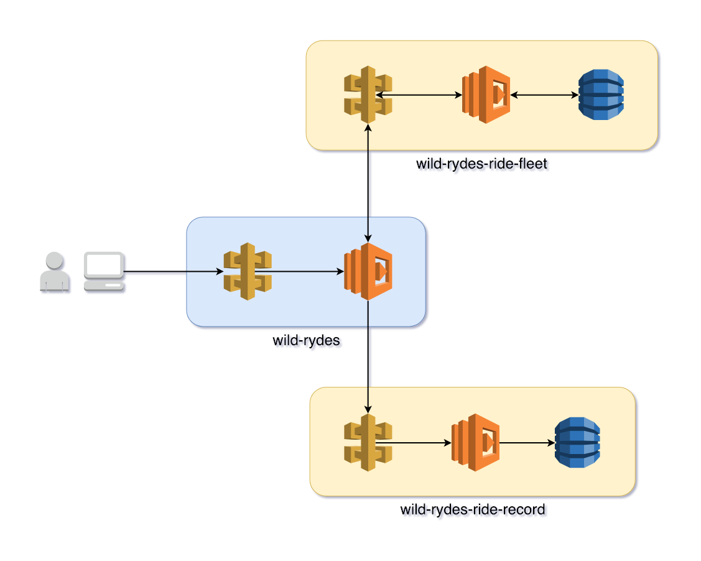
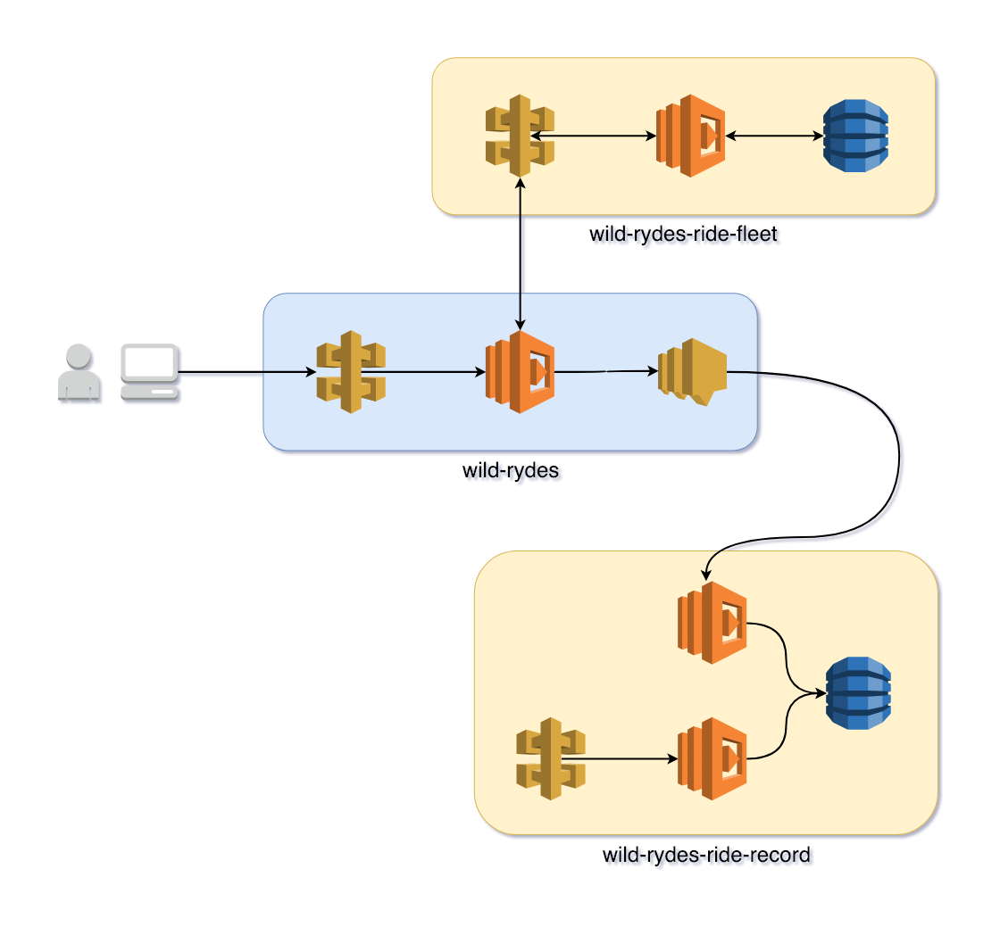

# Serverless Asynchronous Event-Driven Architecture

<!--
    Focus on:
        * Event driven v. request driven architecture
        * cost & performance (bypass APIG to lower cost and increase performance)
-->

In this module we'll cover event driven architecture and asynchronous service communication. We'll do this by refactoring the _wild-rydes-ride-record_ service to support an event driven architecture in addition to its microservice web request architecture.

## Goals and Objectives


<!-- FIXME: Fix goals and objectives. -->
__Objectives:__
* Understand event-driven architecture and asynchronous service communication.

__Goals:__
* Refactor _wild-rydes-request-ride_ for event-driven architecture.

## Event-Driven Architecture
<!-- FIXME: Add diagram of current arch and future arch -->
So far the Wild Rydes application has used a traditional web services microservice design.  That is, we have separately deployable services that do a particular thing well and communication is performed synchronously between services via web requests. Here is an illustration of the Wild Rydes architecture currently.




In this architecture, the user makes a request for a ride to an API Gateway endpoint which triggers the *RequestRide* Lambda function.  The *RequestRide* function in turn requests a unicorn from the fleet by making a request to the API Gateway for *wild-rydes-ride-fleet* which triggers the *GetUnicorn* Lambda function to fetch a unicorn and return that information to *RequestRide*.  Next, the *RequestRide* function sends data about the ride request to *wild-rydes-ride-record's* API Gateway where it triggers the *RecordRide* Lambda function to write the data to DynamoDB. Finally, a response is sent to a user. This is how a typical web services microservice architecture functions.

Let's take a few moments to examine this architecture and some inefficiencies in it. All the requests between service are made synchronously. Each time *RequestRide* makes a request to another service it waits for that request to complete by the other service responding back. For requesting a member of the ride fleet this makes sense because we expect *RequestRide* to return information about their ride to the user.

<!-- FIXME: we should calculate the amount of latency APIG introduces. -->
On the other hand, the synchronous request to *wild-rides-ride-record* and *RecordRide* adds unnecessary time (and cost as API Gateway requests are billed separately from Lambda function invocations) to the user's request for a ride. From an engineering perspective, API Gateway adds additional overhead to the request in both terms of time and cost. From the view of the user, they are forced to wait for *wild-rydes-ride-record* to receive a request, trigger our Lambda function, write information to DynamnoDB, and return a response to the *wild-rydes* *RequestRide* function. However, none of those operations are relevant to the user as they use the Wild Rydes application.

To improve the user's experience we'll convert the process of recording rides to an event driven architecture. Instead of synchronously making a web services request, *RequestRide* will emit an event which will trigger a new Lambda function in the *wild-rydes-ride-record* service. This is what our new architecture will look like.



Instead of *RequetRide* in the *wild-rydes* service making a web request to the *wild-rydes-ride-record* service to trigger the *RecordRide* Lambda function, *RequestRide* will publish a message to an SNS topic. The *wild-rydes-ride-record* service will have a function that is subscribed to the SNS topic which will write the ride data to DynamoDB. This will allow *RequetRide* to complete and return information to the user without needing to wait for our backend service to write to DynamoDB.

## Instructions

### 1. Deploy new services / update existing
Deploy updates to Wild Rydes application services. This step is to ensure that your code matches the code in the workshop examples.

#### wild-rydes-ride-record
Deploy the wild-rydes-ride-record service. Start by cloning the repository from GitHub, then check out the workshop-operations-01 branch for this workshop module, and finally deploy the application.

```
$ cd $WORKSHOP/
$ rm -rf wild-rydes-ride-record
$ git clone https://github.com/ServerlessOpsIO/wild-rydes-ride-record.git
$ cd wild-rydes-ride-record
$ git checkout -b workshop-architecture-01
$ npm install
$ sls deploy -v
```

#### wild-rydes
Deploy the wild-rydes service. Check out the workshop-operations-01 branch for this workshop module and then deploy the application.

```
$ cd $WORKSHOP/wild-rydes
$ git checkout -b workshop-architecture-01 origin/workshop-architecture-01
$ sls deploy -v
```


### 2. Add SNS topic to _wild-rydes_
Create an SNS topic which *RequestRide* will publish ride information too. Instead of publishing to the *wild-rydes-ride-record* service, waiting for a response, and handling errors from the *wild-rydes-ride-record* service, *RequestRide* will publish a message to SNS and continue on.

This change will:
* Decrease the average duration of the *RequestRide* function.
* Reduce the liklihood of downstream services inducing failure.
* Allow for adding more downstream services without altering *RequestRide*


#### Add SNS topic to *serverless.yml*
Create an SNS topic in the `Resources` section of *serverless.yml*. This SNS topic is where *RequestRide* will publish messages to for containing information about the rides it has dispatched. These messages are intended to be processed by downstream services that do not need to run before the Wild Rydes user has been notified of their impending ride. This change increases the responsiveness of the application to the end user.

The CloudFormation resource name (not the SNS Topic name) should be _RidesSnsTopic_. None of the CloudFormation resource's properties are required, including topic name.

_NOTE: If you decided to set the *TopicName* property then you would have to ensure the SNS topic's name did not conflict with other parallel deployments of *wild-rydes*. We don't manually set the topic name._


Reference the CloudFormation documentation here:

* [CloudFormation AWS::SNS::Topic](https://docs.aws.amazon.com/AWSCloudFormation/latest/UserGuide/aws-properties-sns-topic.html)


<details>
<summary><strong>Answer</strong></summary>
<p>

```diff
--- a/serverless.yml
+++ b/serverless.yml
@@ -80,6 +85,10 @@ functions:
 
 resources:
   Resources:
+
+    RidesSnsTopic:
+      Type: AWS::SNS::Topic
+
     ## Specifying the S3 Bucket
     StaticSite:
       Type: AWS::S3::Bucket
```
</p>
</details>

#### Update *RequestRide* IAM permissions
Next, give the *RequestRide* Lambda function the ability to send messages to the SNS topic.  Do this by adding an additional IAM policy statement under the `provider.iamRoleStatements` key that allows the *sns:Publish* action on the SNS topic. To obtain the SNS topic's ARN, use the CloudFormation *Ref* function.

Reference the Serverless Framework and CloudFormation documentation here:

* [Serverless Framework IAM Role Statements](https://serverless.com/framework/docs/providers/aws/guide/iam/)
* [SNS IAM Permissions](https://docs.aws.amazon.com/sns/latest/dg/AccessPolicyLanguage_SpecialInfo.html)
* [CloudFormation AWS::SNS::Topic - Return Values](https://docs.aws.amazon.com/AWSCloudFormation/latest/UserGuide/aws-properties-sns-topic.html#w2ab1c21c10d198c17b9)


<details>
<summary><strong>Answer</strong></summary>
<p>

```diff
--- a/serverless.yml
+++ b/serverless.yml
@@ -53,6 +53,11 @@ provider:
               - StaticSite
               - Arn
             - '*'
+    - Effect: "Allow"
+      Action:
+        - "sns:Publish"
+      Resource:
+        - Ref: RidesSnsTopic
 
 
 functions:
```
</p>
</details>


#### Publish SNS topic ARN
So that other services can subscribe to the SNS topic, export the topic ARN to AWS SSM Parameter Store. Create an SSM Param Store parameter named `/wild-rydes/STAGE/SnsTopicArn`. _(Where STAGE is replaced by the value of *${self:provider.stage}* from Serverless Framework.)_ To obtain the SNS topic's ARN, use the CloudFormation *Ref* function.

Reference the CloudFormation documentation here:

* [CloudFormation AWS::SSM::Parameter](https://docs.aws.amazon.com/AWSCloudFormation/latest/UserGuide/aws-resource-ssm-parameter.html)
* [CloudFormation AWS::SNS::Topic - Return Values](https://docs.aws.amazon.com/AWSCloudFormation/latest/UserGuide/aws-properties-sns-topic.html#w2ab1c21c10d198c17b9)

<details>
<summary><strong>Answer</strong></summary>
<p>

```diff
--- a/serverless.yml
+++ b/serverless.yml
@@ -89,6 +89,14 @@ resources:
     RidesSnsTopic:
       Type: AWS::SNS::Topic
 
+    RidesSnsTopicArnSsmParam:
+      Type: "AWS::SSM::Parameter"
+      Properties:
+        Name: "/${self:service}/${self:provider.stage}/SnsTopicArn"
+        Type: String
+        Value:
+          Ref: RidesSnsTopic
+
     ## Specifying the S3 Bucket
     StaticSite:
       Type: AWS::S3::Bucket
```
</p>
</details>

#### Pass SNS topic ARN to *RequestRide* Lamda function
The *RequestRide* function now needs to publish to the SNS topic. Edit _serverless.yml_ to pass the SNS topic's ARN to the *RequestRide* function as an environmental variable named *RIDES_SNS_TOPIC_ARN*. Use the CloudFormation *Ref* function again to get the ARN of the SNS topic you  created in previous steps. While you're here, remove the *RIDE_RECORD_URL* environmental variable as it will no longer be necessary.

Reference the Serverless Framework and CloudFormation documentation here:

* [AWS Lambda Environmental Variables](https://serverless.com/framework/docs/providers/aws/guide/functions#environment-variables)
* [CloudFormation AWS::SNS::Topic - Return Values](https://docs.aws.amazon.com/AWSCloudFormation/latest/UserGuide/aws-properties-sns-topic.html#w2ab1c21c10d198c17b9)

<details>
<summary><strong>Answer</strong></summary>
<p>

```
--- a/serverless.yml
+++ b/serverless.yml
@@ -69,7 +69,8 @@ functions:
     environment:
       LOG_LEVEL: "${self:custom.log_level}"
       REQUEST_UNICORN_URL: "${self:custom.request_unicorn_url}"
-      RIDE_RECORD_URL: "${self:custom.ride_record_url}"
+      RIDES_SNS_TOPIC_ARN:
+        Ref: RidesSnsTopic
     events:
       - http:
           path: /ride
```
</p>
</details>

#### Refactor *RequestRide* to publish to new SNS topic

Refactor *handlers/request_ride.py* to publish ride information to the new SNS topic instead of the *wild-rydes-ride-record* via HTTP. _NOTE: In a later step we'll have a Lambda function from the *wild-rydes-ride-record* service subscribe to the topic._

Start by importing the Python AWS SDK *boto3* module.

```diff
--- a/handlers/request_ride.py
+++ b/handlers/request_ride.py
@@ -6,6 +6,7 @@
 import os
 import uuid
 
+import boto3
 import requests
 
 log_level = os.environ.get('LOG_LEVEL', 'INFO')
```

Next get the value of *RIDES_SNS_TOPIC_ARN* from the runtime environment and then create a Boto3 *SNS.Client* object named *SNS_CLIENT*. Do these steps at the top of the file just before Python functions start being defined. (This is so the SNS client object persists across multiple Lambda function invocations.)

<details>
<summary><strong>Hint 1</strong></summary>
<p>

Python Documentation:

* [Python os.environ()](https://docs.python.org/3/library/os.html#os.environ)
* [Boto3 SNS.Client](https://boto3.amazonaws.com/v1/documentation/api/latest/reference/services/sns.html#client)

</p>
</details>

<details>
<summary><strong>Hint 2</strong></summary>
<p>

```diff
--- a/handlers/request_ride.py
+++ b/handlers/request_ride.py
@@ -22,8 +22,14 @@ _logger = logging.getLogger(__name__)
 _logger.addHandler(ThundraLogHandler())

 REQUEST_UNICORN_URL = os.environ.get('REQUEST_UNICORN_URL')
+
+# FIXME: SNS client
+# - change this line to create a variable called RIDES_SNS_TOPIC_ARN by
+#   fetching the RIDES_SNS_TOPIC_ARN environmental variable.
 RIDE_RECORD_URL = os.environ.get('RIDE_RECORD_URL')

+# - Create an SNS Client object called SNS_CLIENT by calling boto3.client('sns')
+

 @Traceable(trace_args=True, trace_return_value=True)
 def _generate_ride_id():
```
</p>
</details>

<details>
<summary><strong>Answer</strong></summary>
<p>

```diff
--- a/handlers/request_ride.py
+++ b/handlers/request_ride.py
@@ -13,7 +14,9 @@
 _logger = logging.getLogger(__name__)
 
 REQUEST_UNICORN_URL = os.environ.get('REQUEST_UNICORN_URL')
-RIDE_RECORD_URL = os.environ.get('RIDE_RECORD_URL')
+
+RIDES_SNS_TOPIC_ARN = os.environ.get('RIDES_SNS_TOPIC_ARN')
+SNS_CLIENT = boto3.client('sns')
 
 
 def _generate_ride_id():
```
</p>
</details>


Further down in the code, replace the *_post_ride_record()* Python function with one called *_publish_ride_record()*. The *_publish_ride_record()* function will take two arguments, one containing ride information and a second containing the SNS topic ARN to publish to. The ride argument is no different than the ride argument that was passed to *_post_ride_record()*. The *_publish_ride_record()* function will call the *SNS_CLIENT.publish()* function to publish the ride message as the message body. The *_publish_ride_record()* function does not return a value. Remember to convert the ride information to a JSON string using by calling the *json.dumps()* Python function. Also, remember to add the Thundra *Traceable* decorator to the *_publish_ride_record()* function.


<details>
<summary><strong>Hint 1</strong></summary>
<p>

Python Documentation:

* [Boto3 SNS.Client.publish()](https://boto3.amazonaws.com/v1/documentation/api/latest/reference/services/sns.html#SNS.Client.publish)

</p>
</details>

<details>
<summary><strong>Hint 2</strong></summary>
<p>

```diff
--- a/handlers/request_ride.py
+++ b/handlers/request_ride.py
@@ -51,6 +51,7 @@ def _get_pickup_location(body):
     return body.get('PickupLocation')


+# FIXME: Remove this function.
 def _post_ride_record(ride, url=RIDE_RECORD_URL):
     '''Record ride info'''
     resp = requests.post(
@@ -61,6 +62,17 @@ def _post_ride_record(ride, url=RIDE_RECORD_URL):
     return resp


+# FIXME: Publish a ride to SNS
+# - The RIDES_SNS_TOPIC_ARN variables is one you created earlier in the file
+#   by fetching a value from the runtime environment.
+# - Publish a message by calling SNS_CLIENT.publish(). SNS_CLIENT is the name
+#   of the SNS.Client object you created earlier.
+# - Remember to convert the ride variable to JSON by calling json.dumps(ride).
+def _publish_ride_record(ride, sns_topic_arn=RIDES_SNS_TOPIC_ARN):
+    '''Publish ride info to SNS'''
+    pass
+
+
 def handler(event, context):
     '''Function entry'''
     _logger.info('Request: {}'.format(json.dumps(event)))
@@ -68,6 +80,7 @@ def handler(event, context):
     body = json.loads(event.get('body'))
     pickup_location = _get_pickup_location(body)
     ride_resp = _get_ride(pickup_location)
+    # FIXME: replace _post_ride_record() with _publish_ride_record()
     _post_ride_record(ride_resp)

     resp = {
```
</p>
</details>

<details>
<summary><strong>Answer</strong></summary>
<p>

```diff
--- a/handlers/request_ride.py
+++ b/handlers/request_ride.py
@@ -51,15 +54,13 @@ def _get_pickup_location(body):
     return body.get('PickupLocation')
 
 
-def _post_ride_record(ride, url=RIDE_RECORD_URL):
-    '''Record ride info'''
-    resp = requests.post(
-        url,
-        json=ride
+def _publish_ride_record(ride, sns_topic_arn=RIDES_SNS_TOPIC_ARN):
+    '''Publish ride info to SNS'''
+    SNS_CLIENT.publish(
+        TopicArn=sns_topic_arn,
+        Message=json.dumps(ride)
     )
 
-    return resp
-
 
 def handler(event, context):
     '''Function entry'''
@@ -68,7 +69,7 @@ def handler(event, context):
     body = json.loads(event.get('body'))
     pickup_location = _get_pickup_location(body)
     ride_resp = _get_ride(pickup_location)
-    _post_ride_record(ride_resp)
+    _publish_ride_record(ride_resp)
 
     resp = {
         'statusCode': 201,
```
</p>
</details>

#### Deploy updated *wild-rydes* service
Deploy the newly updated *wild-rydes*.

*NOTE: This will create a minor service disruption as ride records will not be sent to wild-rydes-ride-record until that service is updated in the following steps. We are proceeding this way for clarity in this workshop. You would do more iterative changes and deploys if this were a production system.*

```
$ cd $WORKSHOP/wild-rydes
$ sls deploy -v
```

### 3. Refactor *handlers/put_ride_record.py* in *wild-rydes-ride-record* to support API Gateway and SNS events
Refactor *handlers/put_ride_record.py* so there are separate handler functions for both API Gateway and SNS events and a function to write data to DynamoDB. To do this we want to ensure that there is a logical separation in our code between the handling of invocation events and the writing of data to DynamoDB.

Look at the current *handler()* code in *handlers/put_ride_record.py*:
```python
def handler(event, context):
    '''Function entry'''
    _logger.info('Event received: {}'.format(json.dumps(event)))

    ride_record = json.loads(event.get('body')

    try:
        DDT.put_item(
            TableName=DDB_TABLE_NAME,
            Item=ride_record
        )
    except Exception as e:
        _logger.exception(e)
        raise e

    resp = {
        'statusCode': 201,
        'body': json.dumps({'success': True})
    }

    _logger.info('Response: {}'.format(json.dumps(resp)))

    return resp
```

The *handler()* function does the following:

* Receive an event
* Extracts ride data from it
* Writes it to DynamoDB
* Respond back to API Gateway

We want to split the event handling from the writing to DynamoDB in the next few steps. Once you are done, you will end up with the three following Python functions:

* *handler_http()*
* *handler_sns()*
* *_put_ride_record()*

#### Create *handlers/put_ride_record.handler_http()*
Create the Python function *handler_http()* in the *handlers/put_ride_record.py* file.

This function will:
* Be triggered by an API Gateway event
* Extract the ride information from the `body` key of the API Gateway event
  * Also convert the data from JSON to a Python dictionary by using *json.dumps()*
* Pass the ride information to the *_put_ride_record()* Python function (this function is to be written later)
* Return an HTTP 201 response to API Gateway

The function is almost identical to the existing *handler()* function. The exception is where *handler()* attempts to write to DynamoDB, *handler_http()* will call *_put_ride_record()* and pass ride data to it.

<details>
<summary><strong>API Gateway Event</strong></summary>
<p>

```
{
    "resource": "/record",
    "path": "/record",
    "httpMethod": "POST",
    "headers": {
        "Accept": "*/*",
        "CloudFront-Forwarded-Proto": "https",
        "CloudFront-Is-Desktop-Viewer": "true",
        "CloudFront-Is-Mobile-Viewer": "false",
        "CloudFront-Is-SmartTV-Viewer": "false",
        "CloudFront-Is-Tablet-Viewer": "false",
        "CloudFront-Viewer-Country": "US",
        "content-type": "application/json",
        "Host": "6u0f8wo646.execute-api.us-east-1.amazonaws.com",
        "User-Agent": "curl/7.54.0",
        "Via": "2.0 488ca64b2230001b81f1cbf87d34963b.cloudfront.net (CloudFront)",
        "X-Amz-Cf-Id": "EbJtXrattxCp_kGiAvOkZQfqrU7GaCnWQOBd_sqWLOu1CI3mg5hzew==",
        "X-Amzn-Trace-Id": "Root=1-5b6e22fc-caa80860f02a362eda99cf9c",
        "X-Forwarded-For": "73.17.175.174, 52.46.29.59",
        "X-Forwarded-Port": "443",
        "X-Forwarded-Proto": "https"
    },
    "queryStringParameters": null,
    "pathParameters": null,
    "stageVariables": null,
    "requestContext": {
        "resourceId": "spy0ia",
        "resourcePath": "/record",
        "httpMethod": "POST",
        "extendedRequestId": "LbpnYHl3oAMFYUg=",
        "requestTime": "10/Aug/2018:23:42:52 +0000",
        "path": "/dev/record",
        "accountId": "144121712529",
        "protocol": "HTTP/1.1",
        "stage": "dev",
        "requestTimeEpoch": 1533944572060,
        "requestId": "18bb8de3-9cf7-11e8-aa6f-eda086839e1d",
        "identity": {
            "cognitoIdentityPoolId": null,
            "accountId": null,
            "cognitoIdentityId": null,
            "caller": null,
            "sourceIp": "73.17.175.174",
            "accessKey": null,
            "cognitoAuthenticationType": null,
            "cognitoAuthenticationProvider": null,
            "userArn": null,
            "userAgent": "curl/7.54.0",
            "user": null
        },
        "apiId": "6u0f8wo646"
    },
    "body": "{\"RideId\": \"cb4e0e60-9c23-11e8-af29-8a060cb55967\", \"Unicorn\": {\"Name\": \"Bucephalus\", \"Color\": \"Golden\"}, \"RequestTime\": \"2018-08-09 22:30:18.347888\"}",
    "isBase64Encoded": false
}
```
</p>
</details>

<details>
<summary><strong>Answer</strong></summary>
<p>

```diff
--- a/handlers/put_ride_record.py
+++ b/handlers/put_ride_record.py
@@ -16,6 +16,23 @@
 dynamodb = boto3.resource('dynamodb')
 DDT = dynamodb.Table(DDB_TABLE_NAME)
 
+def handler_http(event, context):
+    '''Function entry'''
+    _logger.info('Event received: {}'.format(json.dumps(event)))
+
+    ride_record = json.loads(event.get('body'))
+
+    _put_ride_record(ride_record)
+
+    resp = {
+        'statusCode': 201,
+        'body': json.dumps({'success': True})
+    }
+
+    _logger.info('Response: {}'.format(json.dumps(resp)))
+
+    return resp
+
 
 def handler(event, context):
     '''Function entry'''
```
</p>
</details>


#### Create *handlers/put_ride_record.handler_sns()*
Create the Python function *handler_sns()* in the file *handlers/put_ride_record.py*.

This function will:
* Be triggered by an SNS event
* Extract the ride information from the `Records[0].Sns.Message` key of the API Gateway event
  * Also convert the data from JSON to a Python dictionary by using *json.dumps()*
* Pass the ride information to the *_put_ride_record()* Python function.
* This handler function does not need to return a response


<details>
<summary><strong>SNS Event</strong></summary>
<p>

```
{
  "Records": [
    {
      "EventVersion": "1.0",
      "EventSubscriptionArn": "arn:aws:sns:us-east-1:{{accountId}}:ExampleTopic",
      "EventSource": "aws:sns",
      "Sns": {
        "SignatureVersion": "1",
        "Timestamp": "1970-01-01T00:00:00.000Z",
        "Signature": "EXAMPLE",
        "SigningCertUrl": "EXAMPLE",
        "MessageId": "95df01b4-ee98-5cb9-9903-4c221d41eb5e",
        "Message": "{\"RideId\": \"cb4e0e60-9c23-11e8-af29-8a060cb55967\", \"Unicorn\": {\"Name\": \"Bucephalus\", \"Color\": \"Golden\"}, \"RequestTime\": \"2018-08-09 22:30:18.347888\"}",
        "MessageAttributes": {},
        "Type": "Notification",
        "UnsubscribeUrl": "EXAMPLE",
        "TopicArn": "arn:aws:sns:us-east-1:123456789012:ExampleTopic",
        "Subject": "TestInvoke"
      }
    }
  ]
}

```
</p>
</details>

<details>
<summary><strong>Answer</strong></summary>
<p>

```diff
--- a/handlers/put_ride_record.py
+++ b/handlers/put_ride_record.py
@@ -34,6 +34,15 @@ def handler_http(event, context):
     return resp
 
 
+def handler_sns(event, context):
+    '''Function entry'''
+    _logger.info('Event received: {}'.format(json.dumps(event)))
+
+    ride_record = json.loads(event.get('Records')[0].get('Sns').get('Message'))
+
+    _put_ride_record(ride_record)
+
+
 def handler(event, context):
     '''Function entry'''
     _logger.info('Event received: {}'.format(json.dumps(event)))
```
</p>
</details>

#### Create *handlers/put_ride_record._put_ride_record()*
Create the function *_put_ride_record()* which takes a Python dictionary of ride information and writes it to DynamoDB. Use the existing *handler()* function for reference in how to do this.

<details>
<summary><strong>Answer</strong></summary>
<p>

```diff
--- a/handlers/put_ride_record.py
+++ b/handlers/put_ride_record.py
@@ -16,6 +16,19 @@
 dynamodb = boto3.resource('dynamodb')
 DDT = dynamodb.Table(DDB_TABLE_NAME)
 
+
+def _put_ride_record(ride_record):
+    '''Write ride_record to DDB'''
+    try:
+        DDT.put_item(
+            TableName=DDB_TABLE_NAME,
+            Item=ride_record
+        )
+    except Exception as e:
+        _logger.exception(e)
+        raise e
+
+
 def handler_http(event, context):
     '''Function entry'''
     _logger.info('Event received: {}'.format(json.dumps(event)))
```
</p>
</details>


#### Remove *handler()* function
Remove the old *handler()* function since it is no longer necessary.

Expand below to see what the final file should look like.
<details>
<summary><strong>handlers/put_ride_record.py</strong></summary>
<p>

```python
'''Put ride record'''

import json
import logging
import os

import boto3

log_level = os.environ.get('LOG_LEVEL', 'INFO')
logging.root.setLevel(logging.getLevelName(log_level))  # type: ignore
_logger = logging.getLogger(__name__)

# DynamoDB
DDB_TABLE_NAME = os.environ.get('DDB_TABLE_NAME')
DDB_TABLE_HASH_KEY = os.environ.get('DDB_TABLE_HASH_KEY')
dynamodb = boto3.resource('dynamodb')
DDT = dynamodb.Table(DDB_TABLE_NAME)


def _put_ride_record(ride_record):
    '''Write ride_record to DDB'''
    try:
        DDT.put_item(
            TableName=DDB_TABLE_NAME,
            Item=ride_record
        )
    except Exception as e:
        _logger.exception(e)
        raise e


def handler_http(event, context):
    '''Function entry'''
    _logger.info('Event received: {}'.format(json.dumps(event)))

    ride_record = json.loads(event.get('body'))

    _put_ride_record(ride_record)

    resp = {
        'statusCode': 201,
        'body': json.dumps({'success': True})
    }

    _logger.info('Response: {}'.format(json.dumps(resp)))

    return resp


def handler_sns(event, context):
    '''Function entry'''
    _logger.info('Event received: {}'.format(json.dumps(event)))

    ride_record = json.loads(event.get('Records')[0].get('Sns').get('Message'))

    _put_ride_record(ride_record)

```
</p>
</details>

### 4. Create new function handlers in *wild-rydes-ride-record*
Add new Lambda functions for the new Python function handlers. You'll do this by replacing the Lambda function *PutRideRecord* with *PutRideRecordSns* and *PutRideRecordHttp*.

#### Update *PutRideRecord* function to become *PutRideRecordHttp*
Rename the *PutRideRecord* Lambda function to *PutRideRecordHttp* in the *serverless.yml* file. After that, update the `handler` key's value to *handlers/put_ride_record.handler_http*.

*NOTE: This will change the name of the CloudWatch log group where log messages are sent to. In our case this change doesn't matter but it may in a production environment. We're renaming the function for clarity and ease of understanding.*

<details>
<summary><strong>Answer</strong></summary>
<p>

```diff
--- a/serverless.yml
+++ b/serverless.yml
@@ -40,9 +40,9 @@ provider:
           - Arn

 functions:
-  PutRideRecord:
-    handler: handlers/put_ride_record.handler
-    description: "Create Ride Record In Table"
+  PutRideRecordHttp:
+    handler: handlers/put_ride_record.handler_http
+    description: "Create Ride Record In Table via API Gateway"
     memorySize: 128
     timeout: 29
     environment:
```
</p>
</details>

#### Create *PutRideRecordSns* function in *serverless.yml*
Add a Lambda function for *PutRideRecordSns*. This function will be much like *PutRideRecordHttp* but will take an SNS event. You will need to get the ARN of the SNS topic from the SSM Parameter Store parameter named `/wild-rydes/STAGE/SnsTopicArn` where stage is the value of *${self:provider.stage}*.

How to trigger a Lambda function via an SNS event can be found here:
* [Serverless Framework SSM variables](https://serverless.com/framework/docs/providers/aws/guide/variables/#reference-variables-using-the-ssm-parameter-store)
* [Serverless Framework SNS Events](https://serverless.com/framework/docs/providers/aws/events/sns/)

<details>
<summary><strong>Answer</strong></summary>
<p>

```diff
--- a/serverless.yml
+++ b/serverless.yml
@@ -16,6 +16,9 @@ custom:
   ddb_table_hash_key: 'RideId'
   sevrice_url_path_base: '/record'
 
+  wild_rydes_sns_topic_arn: "${ssm:/wild-rydes/${self:custom.stage}/SnsTopicArn}"
+
+
 provider:
   name: aws
   runtime: python3.6
@@ -50,6 +53,17 @@ functions:
           method: POST
           path: "${self:custom.sevrice_url_path_base}"
 
+  PutRideRecordSns:
+    handler: handlers/put_ride_record.handler_sns
+    description: "Create Ride Record In Table via SNS event"
+    memorySize: 128
+    timeout: 29
+    environment:
+      DDB_TABLE_NAME:
+        Ref: RideRecordTable
+    events:
+      - sns: "${self:custom.wild_rydes_sns_topic_arn}"
+
 resources:
   Resources:
     RideRecordTable:```
</p>
</details>

### 5. Deploy *wild-rides-ryde-record*
Deploy the updated *wild-rides-ryde-record* service.

```
$ sls deploy -v
```

## Q&A

### 1. Asynchronous Event Driven Architecture

### 2. Refactoring

Q. How might you reorder the steps in this workshop if you wanted to make incremental changes that you could deploy along the way instead of making one larger refactoring?

The instructions in this module are meant to be easy to follow but aren't necessarily the best order of operations for refactoring an application. You can reorder these steps (and add additional steps) to you make incremental progress which makes tracking down mistakes easier.

<details>
<summary><strong>Output</strong></summary>

1. Refactor handlers/put_ride_record.py in _wild-rydes-ride-record_ to create *handlers/put_ride_record.put_ride_record* and *handlers/put_ride_record.handler_http*
1. Update PutRideRecord function to become PutRideRecordHttp in serverless.yml
1. Deploy *wild-rydes-ride-record*
1. Successfully request a ride
1. Add SNS topic to _wild-rydes_ and export topic name to SSM Param store
1. Deploy *wild-rydes*
1. Create handlers/put_ride_record.handler_sns
1. Create PutRideRecordSns function in serverless.yml
1. Subscribe PutRideRecordSns function to _wild-rydes_ SNS topic
1. Deploy *wild-rydes-ride-record*
1. Refactor _RequestRide_ to publish to new SNS topic
1. Deploy *wild-rydes* and request a ride

<p>
</p>
</details>

Q. The retyr behavior of a Lambda function when it has failed is determined by the event type that triggered the function. [The different AWS Lambda retry behaviors are described in this documentation.](https://docs.aws.amazon.com/lambda/latest/dg/retries-on-errors.html) Explain the difference in reytry behavior between Lambda functions triggered by an SNS message and Lambda functions triggered by an API Gateway request.

Q. EXTRA CREDIT: Calculate the overhead API Gateway causes on Wild Rydes.

### 3. Service Discovery

Q. SSM parameter store...
