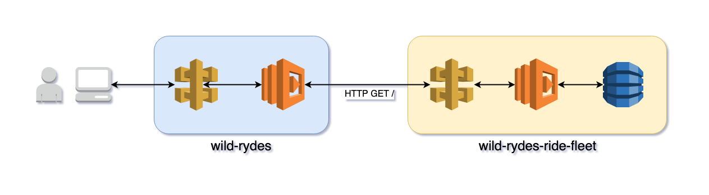
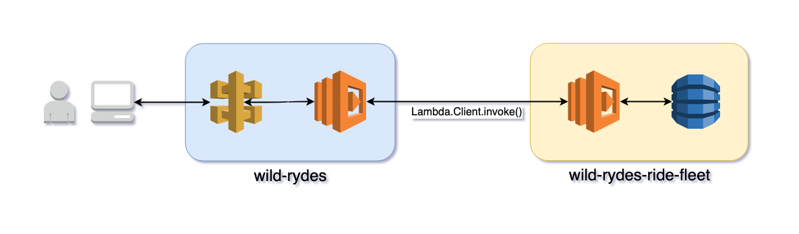

# Serverless Synchronous Requests

In this module we'll cover making synchronous requests in between Lambda functions. We'll do that by refactoring *wild-rydes-ride-fleet* *GetUnicorn* to handle direct invocation by *RequestRide* in *wild-rydes*, bypassing API Gateway.

## Goals and Objectives
**Objectives:**
* Understand how to perform synchronous requests when you may have made a web request

**Goals:**
* Refactor *wild-rydes-ride-fleet* *GetUnicorn* to be invoked directly

## Synchronous Requests

In the previous module we noted how our architecture started as a traditional web microservices architecture and how some communication between services could be refactored into an asynchronous event driven architecture which results in faster responses to the user. But not every operation easily fits that pattern easily. And while continuing with a web microservices pattern using API Gateway and Lambda is just fine in many cases, it does add an additional cost (API Gateway requests are charged independent of Lambda invokations) and API Gateway can add additional request latency.

One common operation is fetching data from a data store and returning it to a user. For example, this communication below where out application requests a unicorn from the fleet so it can tell the user who will be picking them up.



While this can be done with an asynchronous event-driven architecture, that can be complex to implement and beyond the complexity required for what you're trying to accomplish. And as noted earlier API Gateway has potential minor drawbacks related to cost and latency. If you decide you want to make synchronous requests but it's advantageous for you to not use API Gateway then what do you do?

In this module we'll demonstrate how to have one Lambda function invoke another directly. Instead of an HTTP endpoint providing a stable interface to trigger our code, we will trigger a function handler directly using an [AWS SDK API for Lambda function invocation](https://boto3.amazonaws.com/v1/documentation/api/latest/reference/services/lambda.html#Lambda.Client.invoke).



## Instructions

### 1. Update wild-rydes-ride-fleet

Deploy the wild-rydes-ride-fleet service. Check out the *workshop-architecture-01* branch for this workshop module and then deploy the application.

```
$ cd $WORKSHOP/wild-rydes-ride-fleet
$ git checkout -b workshop-architecture-02 origin/workshop-architecture-02
$ sls deploy -v
```

### 2. Refactor *wild-rydes-ride-fleet* *GetUnicorn* for direct invocation.

We'll refactor this service so it's possible to easilly get a unicorn from the fleet by directly invoking the function. When done there will be be a new Lambda function that expects to be invoked directly using the [AWS SDK API for Lambda function invocation](https://boto3.amazonaws.com/v1/documentation/api/latest/reference/services/lambda.html#Lambda.Client.invoke).

_NOTE: We'll create two Lambda functions because we still need the API Gateway for the *LoadTable* Lambda function and custom resource. This way you're not forced to refactor that too._

#### Refactor code in *handlers/get_unicorn.py*

Start by renaming the python function `handler()` to `handler_apig()` to indicate this function is specifically for use with API Gateway. Next create a new handler function named `handler_invoke()` that takes an `event`, and `context` as arguments. The `handler_invoke()` function needs to do one thing, and this is return the value from the function `_get_unicorn()`

<details>
<summary><strong>Answer</strong></summary>
<p>

```diff
--- a/handlers/get_unicorn.py
+++ b/handlers/get_unicorn.py
@@ -31,8 +31,15 @@ def _get_unicorn():
     return unicorn


-def handler(event, context):
-    '''Function entry'''
+def handler_invoke(event, contect):
+    '''Function entry for Lambda synchronous invoke'''
+    _logger.debug('Request: {}'.format(json.dumps(event)))
+
+    return _get_unicorn()
+
+
+def handler_apig(event, context):
+    '''Function entry for APIG'''
     _logger.debug('Request: {}'.format(json.dumps(event)))

     resp = _get_unicorn()
```
</p>
</details>

This refactoring is very easy in part because the `handler()` function previously only handled receiving the triggering event, some basic logging, calling `_get_unicorn()`, and responding to the event source. All the real work of fecthing a unicorn was done in `_get_unicorn()`. If you keep handler logic responsible for event source handling and the business logic of your Lambda function separate it becomes easy to add new or support multiple event sources.

#### Add Function and SSM Paramater to *serverless.yml*
Now add a new function to the _serverless.yml_ file. Rename the _RequestUnicorn_ function to _RequestUnicornApig_ and then change the handler value to `handlers/get_unicorn.handler_apig`. After that, make a copy of the function and rename it _RequestUnicornInvoke_, change the handler value to `handlers/get_unicorn.handler_invoke`, and remove the `event` key and the keys under it.

Your _serverless.yml_ file should now have two functions which correspond to the two handlers you created in *handlers/get_unicorn.py*.
<details>
<summary><strong>Answer</strong></summary>
<p>

```diff
--- a/serverless.yml
+++ b/serverless.yml
@@ -35,9 +35,19 @@ provider:


 functions:
-  RequestUnicorn:
-    handler: handlers/get_unicorn.handler
-    description: "Request a Unicorn."
+  RequestUnicornInvoke:
+    handler: handlers/get_unicorn.handler_invoke
+    description: "Request a Unicorn via Lambda client invocation."
+    memorySize: 128
+    timeout: 29
+    environment:
+      DYNAMODB_TABLE:
+        Ref: UnicornsTable
+      UNICORN_HASH_KEY: "${self:custom.unicorn_hash_key}"
+
+  RequestUnicornApig:
+    handler: handlers/get_unicorn.handler_apig
+    description: "Request a Unicorn via Lambda client invocation."
     memorySize: 128
     timeout: 29
     environment:
```
</p>
</details>

Next, create an SSM paramater named `/wild-rydes-ride-fleet/${self:provider.stage}/RequestUnicornInvokeArn` with a value of the ARN of the *RequestUnicornInvoke* Lambda function. You can use the *Fn::GetAtt* CloudFormation function to get the Arn.

_NOTE: Serverless Framework renames function resourcess in the template it generates by adding "LambdaFunction" onto the end of the name. You'll need to use the Fn::GetAtt with the renamed resource. eg. RequestUnicornInvoke -> RequestUnicornInvokeLambdaFunction _

* [Cloudformation AWS::SSM::Parameter](https://docs.aws.amazon.com/AWSCloudFormation/latest/UserGuide/aws-resource-ssm-parameter.html)
* [Cloudformation function Fn::GetAtt](https://docs.aws.amazon.com/AWSCloudFormation/latest/UserGuide/intrinsic-function-reference-getatt.html)
* [Fn::GetAtt for AWS::Lambda::Function](https://docs.aws.amazon.com/AWSCloudFormation/latest/UserGuide/aws-resource-lambda-function.html#w2ab1c21c10d177c21b9b5)

<details>
<summary><strong>Answer</strong></summary>
<p>

```diff
--- a/serverless.yml
+++ b/serverless.yml
@@ -91,6 +101,17 @@ resources:
               - Ref: AWS::Region
               - ".amazonaws.com/${self:custom.stage}"

+    RequestUnicornInvokeArnSsmParam:
+      Type: AWS::SSM::Parameter
+      Properties:
+        Description: "Arn of RequestUnicorn Lambda function"
+        Type: String
+        Name: "/${self:service}/${self:provider.stage}/RequestUnicornInvokeArn"
+        Value:
+          Fn::GetAtt:
+            - RequestUnicornInvokeLambdaFunction
+            - Arn
+

   Outputs:
     RequestUnicornUrl:
```
</p>
</details>

#### Deploy

Finally, deploy the updated application. Fix any errors if your deploy is not successful

```
$ cd $WORKSHOP/wild-rydes-ride-fleet
$ sls deploy -v
```


### 3. Refactor *RequestRide* in *wild-rydes* to invoke *GetUnicornInvoke*
Now you will refactor the *wild-rydes* service yo bypass API gateway and invoke *GetUnicorn* from *wild-rydes-ride-fleet* directly.

#### Refactor *serverless.yml*
Start in the *serverless.yml* file. Rename `request_unicorn_url` to `request_unicorn_arn`. Then, change it's value from doing a lookup in CloudFormation, to fetcjhong the value of `wild-rydes-ride-fleet/${self:custom.stage}/RequestUnicornInvokeArn` from SSM Parameter Store.

* [Lookup values in AWS SSM Parameter Store](Reference Variables Using AWS SSM Parameter Store)

<details>
<summary><strong>Answer</strong></summary>
<p>

```diff
--- a/serverless.yml
+++ b/serverless.yml
@@ -11,7 +11,7 @@ custom:
   region: "${opt:region, 'us-east-2'}"
   log_level: "${env:LOG_LEVEL, 'INFO'}"

-  request_unicorn_url: "${cf:wild-rydes-ride-fleet-${self:custom.stage}.RequestUnicornUrl}"
+  request_unicorn_arn: "${ssm:/wild-rydes-ride-fleet/${self:custom.stage}/RequestUnicornInvokeArn}"
   ride_record_url: "${ssm:/wild-rydes-ride-record/${self:custom.stage}/URL}"

   hostedZoneName: "${ssm:/route53/root/ServerlessOpsDomain}"
```
</p>
</details>

Next, we set an environmental variable called `REQUEST_UNICORN_URL` for the *RequestRide* function. Replace it with an environmental variable named `REQUEST_UNICORN_ARN` whose value is `${self:custom.request_unicorn_arn}`
<details>
<summary><strong>Answer</strong></summary>
<p>

```diff
--- a/serverless.yml
+++ b/serverless.yml
@@ -68,7 +72,7 @@ functions:
     timeout: 29
     environment:
       LOG_LEVEL: "${self:custom.log_level}"
-      REQUEST_UNICORN_URL: "${self:custom.request_unicorn_url}"
+      REQUEST_UNICORN_ARN: "${self:custom.request_unicorn_arn}"
       RIDES_SNS_TOPIC_ARN:
         Ref: RidesSnsTopic
     events:
```
</p>
</details>

Lastly, we need to grant the *RequestRide* function the ability to invoke the *GetUnicorn* function. To do that, add another IAM statement under `provider.iamRoleStatements`. The statement should allow the `lambda:InvokeFunction` action on the *GetUnicorn* function whose Arn you can get from `${self:custom.request_unicorn_arn}`.

<details>
<summary><strong>Answer</strong></summary>
<p>

```diff
--- a/serverless.yml
+++ b/serverless.yml
@@ -58,6 +58,10 @@ provider:
         - "sns:Publish"
       Resource:
         - Ref: RidesSnsTopic
+    - Effect: "Allow"
+      Action:
+        - "lambda:InvokeFunction"
+      Resource: "${self:custom.request_unicorn_arn}"


 functions:
```
</p>
</details>

#### Refactor *handlers/request_ride.py*

Now move to the *handlers/request_ride.py* file. Similar to what you did in *serverless.yml*, replace the `REQUEST_UNICORN_URL` variable at the top of the file with `REQUEST_UNICORN_ARN` which gets its value from the `REQUEST_UNICORN_ARN` environmental variable.

Once you've done that, create a variable named `LAMBDA_CLIENT` which gets it's value from calling `boto3.client('lambda')`. _(If you look a few lines below you'll see where `SNS_CLIENT` is created which is similar to what you should be adding.)_

<details>
<summary><strong>Answer</strong></summary>
<p>

```diff
--- a/handlers/request_ride.py
+++ b/handlers/request_ride.py
@@ -7,13 +7,13 @@ import os
 import uuid

 import boto3
-import requests

 log_level = os.environ.get('LOG_LEVEL', 'INFO')
 logging.root.setLevel(logging.getLevelName(log_level))  # type:ignore
 _logger = logging.getLogger(__name__)

-REQUEST_UNICORN_URL = os.environ.get('REQUEST_UNICORN_URL')
+REQUEST_UNICORN_ARN = os.environ.get('REQUEST_UNICORN_ARN')
+LAMBDA_CLIENT = boto3.client('lambda')

 RIDES_SNS_TOPIC_ARN = os.environ.get('RIDES_SNS_TOPIC_ARN')
 SNS_CLIENT = boto3.client('sns')
```

</p>
</details>

Next move to the `_get_unicorn()` function. This step can be a little confusing so we'll show you the code change to make and explain it. 


```diff
--- a/handlers/request_ride.py
+++ b/handlers/request_ride.py
@@ -43,10 +43,14 @@ def _get_timestamp_from_uuid(u):
     return datetime.fromtimestamp((u.time - 0x01b21dd213814000) * 100 / 1e9)


-def _get_unicorn(url=REQUEST_UNICORN_URL):
+def _get_unicorn(arn=REQUEST_UNICORN_ARN):
     '''Return a unicorn from the fleet'''
-    unicorn = requests.get(REQUEST_UNICORN_URL)
-    return unicorn.json()
+    response = LAMBDA_CLIENT.invoke(
+        FunctionName=arn
+    )
+    unicorn = response.get('Payload').read().decode()
+    _logger.info('Unicorn: {}'.format(unicorn))
+    return unicorn


 def _get_pickup_location(body):
```

The function will no longer take an argument named `url` with a default value of `REQUEST_UNICORN_URL`, but instead take an argument named `arn` with a default value of `REQUEST_UNICORN_ARN`.

Next, the code no longer makes an HTTP GET request using the `requests` module. Instead it uses the `LAMBDA_CLIENT` created earlier to invoke the _GetUnicorn_ Lambda function directly. The `LAMBDA_CLIENT.invoke()` call requires a`FunctionName` argument which we pass `arn` as the value.

The `LAMBDA_CLIENT.invoke()` call returns a Python dictionary. We're interested in the value of the `Payload ` key which has the unicorn information. However the key's value is not a string, it's a file-like object. We'll read the contents of the file-like object, which is a string containing a JSON document, and convert it from binary to ascii. Finally we return that data from the function. _NOTE: We figured most people would get tripped up by having to fetch the response data by reading the contents of a file._

Pyton Boto 3Documentation 

- [Boto3 Lambda.Client.invoke()](https://boto3.amazonaws.com/v1/documentation/api/latest/reference/services/lambda.html#Lambda.Client.invoke)

#### Deploy

Finally, deploy the updated application. Fix any errors if your deploy is not successful

```
$ cd $WORKSHOP/wild-rydes
$ sls deploy -v
```

### 4. Test application

As a last step, request a ride from the Wild Rydes frontend. If a unicorn appears and you receive no errors then you have completed these steps successfully.

## Q&A

**EXTRA CREDIT:** Refactor the *LoadTable* Lambda function and custom resource in *wild-rydes-ride-fleet* so it does not need API Gateway anymore.