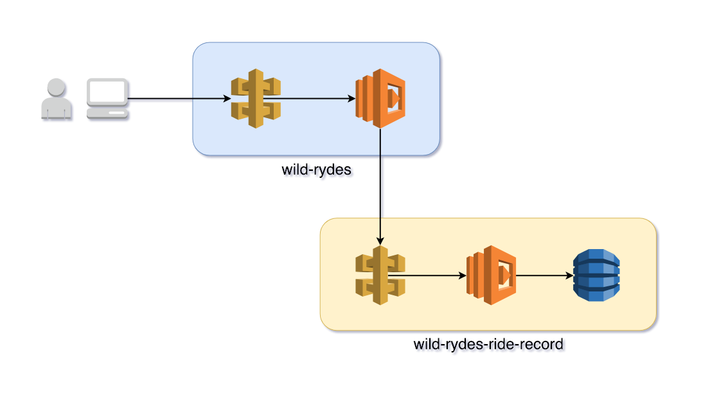

# Serverless Failure

<!--
Maybe this becomes metrics and monitoring?
-->

In this module we’ll increase load on the application to trigger a failure somewhere in the application.

## Goals and Objectives

__Objectives:__

* Understand how to find failures in our application.
* Understand how to instrument a function to obtain metrics, logs, and trace data.

__Goals:__

* Pinpoint application failure that is causing some suers to receive 500 errors.
* Add the Thundra agent to Wyld Rydes applications.

## Serverless Failure And Function Instrumentation
What we'll cover in this module is solving a routine application failure caused by an issue with one of the services. You will see how an error in one service might be discovered by issues found in a different service. It is important to remember that serverless applications composed of many services can become complex and often finding the cause of an issue might require traversing service boundaries. In addition, while the issues we'll be encountering in this module are common, focus on how we found the issues. The process and techniques we use to diagnose the cause of issues is far more important and will help you to solve an even larger variety of issues.

### Serverless Failure

There are many ways a serverless application can fail. In this module you'll be presented with one of them. But you'll have to find what the failure is. Rather than presenting you with a canned set of failure modes, we're going to walk through the process of finding the cause of an unknown failure in this workshop. We also want you to see another important aspect of serverless application failures. The system where you observe the failure symptom may not be the service causing the failure.

### Function Instrumentation
Instrumentation allows us to collect data from our code as it runs so we can determine what it is doing. To instrument some of our code, we'll add the Thundra platform's Python module to the *wild-rydes* *RequestRide* function. By doing this we'll start collecting:

* Function invocation metrics
  * Function duration
  * Memory usage
  * CPU usage
* Function tracing
  * Duration of Python functions inside our Lambda function
* Triggering event data
* Function logs

We'll use the data we gather to help us find where our application is failing.

## Tech Stack

This workshop module will involve the following Wild Rydes services.
* [wild-rydes-ride-record](https://github.com/ServerlessOpsIO/wild-rydes-ride-record): Service for recording rides requested.
* [wild-rydes](https://github.com/ServerlessOpsIO/wild-rydes): Frontend website and ride request service.

*Note: if you've done the [Serverless Up and Running workshop](../../01-up-and-running/02-build-new-service) we'll be replacing what you've deployed with versions meant for this workshop. Without replacing your version with the version for this workshop certain steps may not succeed.*



### Tools

To aid us in this module we'll be employing two tools. We'll use one to help us generate failures by automating requests to the service and another tool to help us find the cause of these failures.

#### Artillery
[Artillery](https://artillery.io/) is a load testing tool taht we will use to simulate traffic on our site. Using this tool we will trigger failures.

#### Thundra
[Thundra](https://thundra.io) is a serverless monitoring and observability platform designed for AWS Lambda environments. The platform will collect function invocation metrics and logs that will help us diagnose the cause of the issues we find.

In this workshop we're using Thundra over AWS CloudWatch, which provides metrics and logging automatically for Lambda functions. We picked Thundra in part because we find it easier to navigate and illustreate what we want people to see. _(From a workshop perspective, we also use it because we don't to grant attendees AWS Console access in our accounts.)_

## Instructions

### 1. Deploy new services / update existing
Deploy updates to Wild Rydes application services.

#### wild-rydes-ride-record
Deploy the *wild-rydes-ride-record* service. We'll be working on issues stemming from this service later on in the workshop.

Start by cloning the repository from GitHub, then check out the *workshop-operations-01* branch for this workshop module, and finally deploy the application.

```
$ cd $WORKSHOP/
$ rm -rf wild-rydes-ride-record
$ git clone https://github.com/ServerlessOpsIO/wild-rydes-ride-record.git
$ cd wild-rydes-ride-record
$ git checkout -b workshop-operations-01
$ npm install
$ sls deploy -v
```

<details>
<summary><strong>Output</strong></summary>
<p>

```
$ cd $WORKSHOP/

$ rm -rf wild-rydes-ride-record

$ git clone https://github.com/ServerlessOpsIO/wild-rydes-ride-record.git
Cloning into 'wild-rydes-ride-record'...
remote: Enumerating objects: 42, done.
remote: Counting objects: 100% (42/42), done.
remote: Compressing objects: 100% (18/18), done.
remote: Total 62 (delta 20), reused 40 (delta 19), pack-reused 20
Unpacking objects: 100% (62/62), done.

$ cd wild-rydes-ride-record

$ git checkout -b workshop-operations-01
Switched to a new branch 'workshop-operations-01'

$ npm install
npm notice created a lockfile as package-lock.json. You should commit this file.
npm WARN wild-rydes-ride-record@0.0.1 No repository field.
npm WARN wild-rydes-ride-record@0.0.1 No license field.

added 38 packages in 2.822s

$ sls deploy -v
Serverless: Installing requirements of requirements.txt in .serverless...
Serverless: Packaging service...
Serverless: Excluding development dependencies...
Serverless: Injecting required Python packages to package...
Serverless: Creating Stack...
Serverless: Checking Stack create progress...
CloudFormation - CREATE_IN_PROGRESS - AWS::CloudFormation::Stack - wild-rydes-ride-record-user0
CloudFormation - CREATE_IN_PROGRESS - AWS::S3::Bucket - ServerlessDeploymentBucket
CloudFormation - CREATE_IN_PROGRESS - AWS::S3::Bucket - ServerlessDeploymentBucket
CloudFormation - CREATE_COMPLETE - AWS::S3::Bucket - ServerlessDeploymentBucket
CloudFormation - CREATE_COMPLETE - AWS::CloudFormation::Stack - wild-rydes-ride-record-user0
Serverless: Stack create finished...
Serverless: Uploading CloudFormation file to S3...
Serverless: Uploading artifacts...
Serverless: Uploading service .zip file to S3 (9.93 KB)...
Serverless: Validating template...
Serverless: Updating Stack...
Serverless: Checking Stack update progress...
CloudFormation - CREATE_COMPLETE - AWS::S3::Bucket - ServerlessDeploymentBucket
CloudFormation - CREATE_COMPLETE - AWS::CloudFormation::Stack - wild-rydes-ride-record-user0
CloudFormation - UPDATE_IN_PROGRESS - AWS::CloudFormation::Stack - wild-rydes-ride-record-user0
CloudFormation - CREATE_IN_PROGRESS - AWS::DynamoDB::Table - RideRecordTable
CloudFormation - CREATE_IN_PROGRESS - AWS::DynamoDB::Table - RideRecordTable
CloudFormation - CREATE_IN_PROGRESS - AWS::ApiGateway::RestApi - ApiGatewayRestApi
CloudFormation - CREATE_IN_PROGRESS - AWS::Logs::LogGroup - PutRideRecordLogGroup
CloudFormation - CREATE_IN_PROGRESS - AWS::ApiGateway::RestApi - ApiGatewayRestApi
CloudFormation - CREATE_IN_PROGRESS - AWS::Logs::LogGroup - PutRideRecordLogGroup
CloudFormation - CREATE_COMPLETE - AWS::ApiGateway::RestApi - ApiGatewayRestApi
CloudFormation - CREATE_COMPLETE - AWS::Logs::LogGroup - PutRideRecordLogGroup
CloudFormation - CREATE_IN_PROGRESS - AWS::ApiGateway::Resource - ApiGatewayResourceRecord
CloudFormation - CREATE_IN_PROGRESS - AWS::SSM::Parameter - ServiceUrlSsmParam
CloudFormation - CREATE_IN_PROGRESS - AWS::ApiGateway::Resource - ApiGatewayResourceRecord
CloudFormation - CREATE_COMPLETE - AWS::ApiGateway::Resource - ApiGatewayResourceRecord
CloudFormation - CREATE_IN_PROGRESS - AWS::SSM::Parameter - ServiceUrlSsmParam
CloudFormation - CREATE_COMPLETE - AWS::SSM::Parameter - ServiceUrlSsmParam
CloudFormation - CREATE_COMPLETE - AWS::DynamoDB::Table - RideRecordTable
CloudFormation - CREATE_IN_PROGRESS - AWS::IAM::Role - IamRoleLambdaExecution
CloudFormation - CREATE_IN_PROGRESS - AWS::IAM::Role - IamRoleLambdaExecution
CloudFormation - CREATE_COMPLETE - AWS::IAM::Role - IamRoleLambdaExecution
CloudFormation - CREATE_IN_PROGRESS - AWS::Lambda::Function - PutRideRecordLambdaFunction
CloudFormation - CREATE_IN_PROGRESS - AWS::Lambda::Function - PutRideRecordLambdaFunction
CloudFormation - CREATE_COMPLETE - AWS::Lambda::Function - PutRideRecordLambdaFunction
CloudFormation - CREATE_IN_PROGRESS - AWS::Lambda::Permission - PutRideRecordLambdaPermissionApiGateway
CloudFormation - CREATE_IN_PROGRESS - AWS::Lambda::Version - PutRideRecordLambdaVersionnstGLY8Y7ugslzTFaNWaFAoMN1Z1VWKxXiBV1tWakw
CloudFormation - CREATE_IN_PROGRESS - AWS::Lambda::Permission - PutRideRecordLambdaPermissionApiGateway
CloudFormation - CREATE_IN_PROGRESS - AWS::Lambda::Version - PutRideRecordLambdaVersionnstGLY8Y7ugslzTFaNWaFAoMN1Z1VWKxXiBV1tWakw
CloudFormation - CREATE_COMPLETE - AWS::Lambda::Version - PutRideRecordLambdaVersionnstGLY8Y7ugslzTFaNWaFAoMN1Z1VWKxXiBV1tWakw
CloudFormation - CREATE_IN_PROGRESS - AWS::ApiGateway::Method - ApiGatewayMethodRecordPost
CloudFormation - CREATE_IN_PROGRESS - AWS::ApiGateway::Method - ApiGatewayMethodRecordPost
CloudFormation - CREATE_COMPLETE - AWS::ApiGateway::Method - ApiGatewayMethodRecordPost
CloudFormation - CREATE_IN_PROGRESS - AWS::ApiGateway::Deployment - ApiGatewayDeployment1544478670035
CloudFormation - CREATE_IN_PROGRESS - AWS::ApiGateway::Deployment - ApiGatewayDeployment1544478670035
CloudFormation - CREATE_COMPLETE - AWS::ApiGateway::Deployment - ApiGatewayDeployment1544478670035
CloudFormation - CREATE_COMPLETE - AWS::Lambda::Permission - PutRideRecordLambdaPermissionApiGateway
CloudFormation - UPDATE_COMPLETE_CLEANUP_IN_PROGRESS - AWS::CloudFormation::Stack - wild-rydes-ride-record-user0
CloudFormation - UPDATE_COMPLETE - AWS::CloudFormation::Stack - wild-rydes-ride-record-user0
Serverless: Stack update finished...
Service Information
service: wild-rydes-ride-record
stage: user0
region: us-east-2
stack: wild-rydes-ride-record-user0
api keys:
  None
endpoints:
  POST - https://xzll7s02k0.execute-api.us-east-2.amazonaws.com/user0/record
functions:
  PutRideRecord: wild-rydes-ride-record-user0-PutRideRecord
layers:
  None

Stack Outputs
RideRecordUrl: https://xzll7s02k0.execute-api.us-east-2.amazonaws.com/user0/record
PutRideRecordLambdaFunctionQualifiedArn: arn:aws:lambda:us-east-2:144121712529:function:wild-rydes-ride-record-user0-PutRideRecord:1
ServiceEndpoint: https://xzll7s02k0.execute-api.us-east-2.amazonaws.com/user0
ServerlessDeploymentBucketName: wild-rydes-ride-record-u-serverlessdeploymentbuck-1y0rb3x7myiu6
```
</p>
</details>


#### wild-rydes
Deploy the *wild-rydes* service. It has updates to work with the *wild-rydes-ride-record* service. In later steps you'll be instrumenting this function to collect runtime and log data from invocations to the Thundra platform.

Start by cloning the repository from GitHub, then check out the *workshop-operations-01* branch for this workshop module, and finally deploy the application.
```
$ cd $WORKSHOP/wild-rydes
$ git checkout -b workshop-operations-01 origin/workshop-operations-01
$ sls deploy -v
```

<details>
<summary><strong>Output</strong></summary>
<p>

```
$ cd $WORKSHOP/wild-rydes

$ git checkout -b workshop-operations-01 origin/workshop-operations-01
Branch 'workshop-operations-01' set up to track remote branch 'workshop-operations-01' from 'origin'.
Switched to a new branch 'workshop-operations-01'

$ sls deploy -v
Serverless: Generated requirements from /workshop/wild-rydes/requirements.txt in /workshop/wild-rydes/.serverless/requirements.txt...
Serverless: Installing requirements from /workshop/wild-rydes/.serverless/requirements/requirements.txt ...
Serverless: Packaging service...
Serverless: Excluding development dependencies...
Serverless: Injecting required Python packages to package...
Serverless: Uploading CloudFormation file to S3...
Serverless: Uploading artifacts...
Serverless: Uploading service .zip file to S3 (11.05 MB)...
Serverless: Validating template...
Serverless: Updating Stack...
Serverless: Checking Stack update progress...
CloudFormation - UPDATE_IN_PROGRESS - AWS::CloudFormation::Stack - wild-rydes-user0
CloudFormation - UPDATE_IN_PROGRESS - AWS::Lambda::Function - RequestRideLambdaFunction
CloudFormation - UPDATE_IN_PROGRESS - AWS::Lambda::Function - StaticSiteConfigLambdaFunction
CloudFormation - UPDATE_COMPLETE - AWS::Lambda::Function - StaticSiteConfigLambdaFunction
CloudFormation - UPDATE_COMPLETE - AWS::Lambda::Function - RequestRideLambdaFunction
CloudFormation - CREATE_IN_PROGRESS - AWS::Lambda::Version - RequestRideLambdaVersionTPjn5Eg2c9jcFEs9OosvvLYynFWnAoV4X2Y7AehhpI
CloudFormation - CREATE_IN_PROGRESS - AWS::Lambda::Version - StaticSiteConfigLambdaVersionWRNlKOA92X84UNPr4btbsnM7VG7DqEDgLC8CM4g5UQ
CloudFormation - CREATE_IN_PROGRESS - AWS::Lambda::Version - StaticSiteConfigLambdaVersionWRNlKOA92X84UNPr4btbsnM7VG7DqEDgLC8CM4g5UQ
CloudFormation - CREATE_IN_PROGRESS - AWS::Lambda::Version - RequestRideLambdaVersionTPjn5Eg2c9jcFEs9OosvvLYynFWnAoV4X2Y7AehhpI
CloudFormation - CREATE_COMPLETE - AWS::Lambda::Version - StaticSiteConfigLambdaVersionWRNlKOA92X84UNPr4btbsnM7VG7DqEDgLC8CM4g5UQ
CloudFormation - CREATE_COMPLETE - AWS::Lambda::Version - RequestRideLambdaVersionTPjn5Eg2c9jcFEs9OosvvLYynFWnAoV4X2Y7AehhpI
CloudFormation - CREATE_IN_PROGRESS - AWS::ApiGateway::Deployment - ApiGatewayDeployment1544481666025
CloudFormation - CREATE_IN_PROGRESS - AWS::ApiGateway::Deployment - ApiGatewayDeployment1544481666025
CloudFormation - CREATE_COMPLETE - AWS::ApiGateway::Deployment - ApiGatewayDeployment1544481666025
CloudFormation - UPDATE_COMPLETE_CLEANUP_IN_PROGRESS - AWS::CloudFormation::Stack - wild-rydes-user0
CloudFormation - DELETE_SKIPPED - AWS::Lambda::Version - RequestRideLambdaVersion9DhUrY3R2xOaotSEOuQAPHsTFD8pBKbfLZHByn6n4
CloudFormation - DELETE_IN_PROGRESS - AWS::ApiGateway::Deployment - ApiGatewayDeployment1544478443891
CloudFormation - DELETE_SKIPPED - AWS::Lambda::Version - StaticSiteConfigLambdaVersion5DQtVmvyDvewKEsc9sCS7TX06XSq0aW5VG6Kzqi0UA
CloudFormation - DELETE_COMPLETE - AWS::ApiGateway::Deployment - ApiGatewayDeployment1544478443891
CloudFormation - UPDATE_COMPLETE - AWS::CloudFormation::Stack - wild-rydes-user0
Serverless: Stack update finished...
Service Information
service: wild-rydes
stage: user0
region: us-east-2
stack: wild-rydes-user0
api keys:
  None
endpoints:
  POST - https://isrgpo9ge1.execute-api.us-east-2.amazonaws.com/user0/ride
functions:
  RequestRide: wild-rydes-user0-RequestRide
  StaticSiteConfig: wild-rydes-user0-StaticSiteConfig
layers:
  None

Stack Outputs
RequestRideLambdaFunctionQualifiedArn: arn:aws:lambda:us-east-2:144121712529:function:wild-rydes-user0-RequestRide:2
StaticSiteConfigLambdaFunctionQualifiedArn: arn:aws:lambda:us-east-2:144121712529:function:wild-rydes-user0-StaticSiteConfig:2
StaticSiteS3BucketName: wild-rydes-user0.dev.training.serverlessops.io
StaticSiteS3BucketWebsiteURL: http://wild-rydes-user0.dev.training.serverlessops.io
ServiceEndpoint: https://isrgpo9ge1.execute-api.us-east-2.amazonaws.com/user0
ServerlessDeploymentBucketName: wild-rydes-user0-serverlessdeploymentbucket-mmzjmy0d05dh

S3 Sync: Syncing directories and S3 prefixes...
.
S3 Sync: Synced.
```

</p>
</details>

### 2. Generate load on application
Use Artillery to generate load on the Wild Rydes application. By doing this we'll trigger some failures.

Start by installing Artillery.
```
$ npm install -g artillery --ignore-scripts
```

<details>
<summary><strong>Output</strong></summary>
<p>

```
/usr/bin/artillery -> /usr/lib/node_modules/artillery/bin/artillery
+ artillery@1.6.0-26
added 266 packages in 6.101s
```
</p>
</details>

Artillery will bypass the application frontend and directly call the API Gateway endpoint in *wild-rydes* that triggers the *RequestRide* Lambda function. Start by getting the value of *ServiceEndpoint* from the *wild-rydes* stack outputs. Use `sls info -v` to obtain the value. You'll need this value so you know what API endpoint to target with Artillery.
```
$ cd $WORKSHOP/wild-rydes
$ sls info -v
```

<details>
<summary><strong>Output</strong></summary>
<p>

```
Service Information
service: wild-rydes
stage: user0
region: us-east-2
stack: wild-rydes-user0
api keys:
  None
endpoints:
  POST - https://isrgpo9ge1.execute-api.us-east-2.amazonaws.com/user0/ride
functions:
  RequestRide: wild-rydes-user0-RequestRide
  StaticSiteConfig: wild-rydes-user0-StaticSiteConfig
layers:
  None

Stack Outputs
RequestRideLambdaFunctionQualifiedArn: arn:aws:lambda:us-east-2:144121712529:function:wild-rydes-user0-RequestRide:2
StaticSiteConfigLambdaFunctionQualifiedArn: arn:aws:lambda:us-east-2:144121712529:function:wild-rydes-user0-StaticSiteConfig:2
StaticSiteS3BucketName: wild-rydes-user0.dev.training.serverlessops.io
StaticSiteS3BucketWebsiteURL: http://wild-rydes-user0.dev.training.serverlessops.io
ServiceEndpoint: https://isrgpo9ge1.execute-api.us-east-2.amazonaws.com/user0   <==== THIS VALUE
ServerlessDeploymentBucketName: wild-rydes-user0-serverlessdeploymentbucket-mmzjmy0d05dh
```
</p>
</details>

Run the Artillery tool against the web endpoint for *RequestRide* in *wild-rydes*. This will trigger failures for us to investigate. We'll see evidence of those failures in the form of response codes with a value other than `201`.

The configuration file for Artillery will run the command for 3 minutes. You may not see errors at first but let the script continue to run.

```
$ artillery run -t <ServiceEndpoint> -c tests/artillery-high-load-config.yml tests/artillery.yml
```

In the output under the `Codes` section of the final report you should see HTTP 5XX codes

```
All virtual users finished
Summary report @ 00:51:39(+0000) 2018-12-07
  Scenarios launched:  1800
  Scenarios completed: 1800
  Requests completed:  1800
  RPS sent: 8.66
  Request latency:
    min: 874.4
    max: 29500.8
    median: 1269.2
    p95: 29360.8
    p99: 29365.6
  Scenario counts:
    0: 1800 (100%)
  Codes:
    201: 1492
    502: 106
    504: 202
```

<!-- FIXME: Update wild-rydes to throw an error when it receives back an error timeout from wild-rydes-ride-record. -->
Error codes:
* 502: Function returned bad response. Typically the Lambda function errored our.
* 504: API Gateway timed out. API Gateway has a 29 second limit for any integrations (Lambda functions, authorizers, etc.) to run. <!-- This error can occur for any number of reasons but in this workshop it's probably the combination of a Lambda cold start and the length of time spent attempting to send data to the *wild-rydes-ride-record* service. -->

*NOTE: You might only get a single error code. The issue we're triggering can trigger both HTTP error codes as a symptom.*

<!-- FIXME: We should maybe look at min/max/median/p95/p99? Maybe wait until Thundra has dashboards. -->

### 3. Collect metrics and logs from *wild-rydes* *RequestRide*
<!-- Start collecting traces and logs -->
Start collecting metrics and logs from *RequestRide* in *wild-rydes* to the Thundra platform. We'll instrument this function by using the [Thundra Python agent](https://github.com/thundra-io/thundra-lambda-agent-python). (You'll instrument the Lambda functions in *wild-rydes-ride-record* in a later module.) By instrumenting the function we'll allow the Thundra platform to start collecting invocation metrics, logs, and trace the length of time spent performing different actions in the Lambda function's code.

*NOTE: Thundra has the ability to automatically instrument functions through the Serverless Framework plugin [serverless-plugin-thundra](https://github.com/thundra-io/serverless-plugin-thundra). This workshop insruments the function manually to demonstrate the actual work involved. We feel this is important for those coming to serverless without an extensive coding background. We want people to see how approachable this work is for non-developers.*

#### Add Thundra module
<!-- FIXME: Evaluate Thundra automated for time. -->
Add the Thundra Python module to *wild-rydes*. By adding the module we allow Thundra to start collecting basic invocation metrics such as duration, memory usage, and CPU usage.

<!-- install Python module -->
Start by installing the Python module for Thundra.
```
$ cd $WORKSHOP/wild-rydes
$ echo thundra >> requirements.txt
$ pip3 install -r requirements.txt
```
<details>
<summary><strong>Output</strong></summary>
<p>

```
$ cd $WORKSHOP/wild-rydes

$ echo thundra >> requirements.txt

$ pip3 install -r requirements.txt
Collecting boto3 (from -r requirements.txt (line 1))
  Using cached https://files.pythonhosted.org/packages/9c/b9/7df67f1775d240ac8d111211f967fa75ecc9968ae79ffa0594e36345445f/boto3-1.9.62-py2.py3-none-any.whl
Collecting cfn_resource (from -r requirements.txt (line 2))
  Using cached https://files.pythonhosted.org/packages/f0/98/313292b9764a98824e613367bd5b7e061c93c77985d277ee324823b8c43a/cfn_resource-0.2.3.tar.gz
Collecting thundra (from -r requirements.txt (line 4))
  Downloading https://files.pythonhosted.org/packages/b3/cc/2911c189b7b58f991d443a39a2db6032101f30fa83f0c713aa93ad8648a7/thundra-2.0.2-py3-none-any.whl
Collecting botocore<1.13.0,>=1.12.62 (from boto3->-r requirements.txt (line 1))
  Using cached https://files.pythonhosted.org/packages/e2/77/35e82076e3beb506280f94213a258819378115f174e516ce69b3a2336e1c/botocore-1.12.62-py2.py3-none-any.whl
Requirement already satisfied: s3transfer<0.2.0,>=0.1.10 in /usr/lib/python3.6/site-packages (from boto3->-r requirements.txt (line 1))
Requirement already satisfied: jmespath<1.0.0,>=0.7.1 in /usr/lib/python3.6/site-packages (from boto3->-r requirements.txt (line 1))
Collecting opentracing>=2.0 (from thundra->-r requirements.txt (line 4))
  Downloading https://files.pythonhosted.org/packages/33/25/56d29df57d9cb700eab7ed3bae447ce9b7031e5a10c16a4c558eb0a06c7b/opentracing-2.0.0.tar.gz (53kB)
    100% |████████████████████████████████| 61kB 3.9MB/s
Requirement already satisfied: urllib3<1.25,>=1.20; python_version >= "3.4" in /usr/lib/python3.6/site-packages (from botocore<1.13.0,>=1.12.62->boto3->-r requirements.txt (line 1))
Requirement already satisfied: docutils>=0.10 in /usr/lib/python3.6/site-packages (from botocore<1.13.0,>=1.12.62->boto3->-r requirements.txt (line 1))
Requirement already satisfied: python-dateutil<3.0.0,>=2.1; python_version >= "2.7" in /usr/lib/python3.6/site-packages (from botocore<1.13.0,>=1.12.62->boto3->-r requirements.txt (line 1))
Requirement already satisfied: six>=1.5 in /usr/lib/python3.6/site-packages (from python-dateutil<3.0.0,>=2.1; python_version >= "2.7"->botocore<1.13.0,>=1.12.62->boto3->-r requirements.txt (line 1))
Installing collected packages: botocore, boto3, cfn-resource, opentracing, thundra
  Found existing installation: botocore 1.12.31
    Uninstalling botocore-1.12.31:
      Successfully uninstalled botocore-1.12.31
  Running setup.py install for cfn-resource ... done
  Running setup.py install for opentracing ... done
Successfully installed boto3-1.9.62 botocore-1.12.62 cfn-resource-0.2.3 opentracing-2.0.0 thundra-2.0.2
You are using pip version 9.0.3, however version 18.1 is available.
You should consider upgrading via the 'pip install --upgrade pip' command.
```
</p>
</details>


#### Update *serverless.yml*
<!-- Add API key to serverless.yml -->
<!-- FIXME: We might condense this to a single step. Maybe don't need param under custom section.-->
Add the Thundra API key to the *serverless.yml* file. This API key is necessary for the Thundra agent to ship to the platform. You'll fetch the key value from AWS SSM Parameter Store where we've centrally stored it and then configure it be an environmental variable value in the Lambda function's runtime environment.

In the *serverless.yml* file create the key *custom.thundraApiKey*. (You're creating a key called *thundraApiKey* under the *custom* key in the file.) The API key's value is stored in AWS SSM Parameter Store under the name `/thundra/root/api-key`. Use Serverless Framework's ability to lookup values in SSM Parameter Store to populate the key value.

* [Reference Variables Using AWS SSM Parameter Store](https://serverless.com/framework/docs/providers/aws/guide/variables/#reference-variables-using-the-ssm-parameter-store)

<details>
<summary><strong>Answer</strong></summary>
<p>

```diff
--- a/serverless.yml
+++ b/serverless.yml
@@ -11,6 +11,8 @@ custom:
   region: "${opt:region, 'us-east-2'}"
   log_level: "${env:LOG_LEVEL, 'INFO'}"

+  thundraApiKey: "${ssm:/thundra/root/api-key}"
+
   request_unicorn_url: "${cf:wild-rydes-ride-fleet-${self:custom.stage}.RequestUnicornUrl}"
   ride_record_url: "${ssm:/wild-rydes-ride-record/training-dev/URL}"

```
</p>
</details>

<!-- pass API key to function environment -->
Next, create create an environmental variable key called `THUNDRA_API_KEY`. Its value will come from referencing the *custom.thundraApiKey* key in the previous step.

* [Reference Properties In *serverless.yml*](https://serverless.com/framework/docs/providers/aws/guide/variables/#reference-properties-in-serverlessyml)
* [AWS Lambda Environmental Variables](https://serverless.com/framework/docs/providers/aws/guide/functions#environment-variables)

<details>
<summary><strong>Answer</strong></summary>
<p>

```diff
--- a/serverless.yml
+++ b/serverless.yml
@@ -37,6 +39,7 @@ provider:
   cfnRole: "arn:aws:iam::${env:AWS_ACCOUNT}:role/CloudFormationDeployRole"
   environment:
     LOG_LEVEL: ${self:custom.log_level}
+    THUNDRA_API_KEY: ${self:custom.thundraApiKey}
   stackTags:
     serverless:service: ${self:service}
   iamRoleStatements:
```
</p>
</details>

#### Update *handlers/request_ride.py*
Import the *thundra* Python module in *handlers/request_ride.py*. Then, initialize it using the `THUNDRA_API_KEY` value obtained from the runtime environment. Finally, add the Python function decorator to the *handler()* function in the file. See the file diff below for what needs to be added.

```diff
--- a/handlers/request_ride.py
+++ b/handlers/request_ride.py
@@ -8,6 +8,11 @@

 from botocore.vendored import requests

+from thundra.thundra_agent import Thundra
+THUNDRA_API_KEY = os.environ.get('THUNDRA_API_KEY', '')
+thundra = Thundra(api_key=THUNDRA_API_KEY)
+
+
 log_level = os.environ.get('LOG_LEVEL', 'INFO')
 logging.root.setLevel(logging.getLevelName(log_level))  # type:ignore
 _logger = logging.getLogger(__name__)
@@ -61,6 +66,7 @@ def _post_ride_record(ride, url=RIDE_RECORD_URL):
     return resp


+@thundra
 def handler(event, context):
     '''Function entry'''
     _logger.info('Request: {}'.format(json.dumps(event)))
```

Your Lambda function now has the Thundra agent integrated. This will collect basic metrics like invocation duration and consumed memory. You'll need to do more work to add logging and tracing.

#### Add logging to *RequestRide* in *wild-rydes*
<!-- Start capturing logs so you can see both failures. -->
Add the Thundra logging handler. This way anytime we use Python's logging facility those messages will be relayed to Thundra. Adding the handler involves importing the *ThundraLogHandler* class and then adding the handler to the *_logger* object. See the file diff below for what needs to be added.

```diff
--- a/handlers/request_ride.py
+++ b/handlers/request_ride.py
@@ -13,9 +13,11 @@
 thundra = Thundra(api_key=THUNDRA_API_KEY)


+from thundra.plugins.log.thundra_log_handler import ThundraLogHandler
 log_level = os.environ.get('LOG_LEVEL', 'INFO')
 logging.root.setLevel(logging.getLevelName(log_level))  # type:ignore
 _logger = logging.getLogger(__name__)
+_logger.addHandler(ThundraLogHandler())

 REQUEST_UNICORN_URL = os.environ.get('REQUEST_UNICORN_URL')
 RIDE_RECORD_URL = os.environ.get('RIDE_RECORD_URL')
```

#### Add tracing to *RequestRide* in wild-rydes
<!-- Is there a performance impact? If so, how much? -->
Add tracing to the Lambda function. Thundra will record the time spend in each function which will allow us to find bottlenecks. Adding tracing support involves importing the *Traceable* decorator and decorating each Python function in the file with the exception of *handler()*. We've also configured the *Traceable* decorator to capture Python function arguments and return values. See the file diff below for what needs to be added.

```diff
--- a/handlers/request_ride.py
+++ b/handlers/request_ride.py
@@ -9,6 +9,8 @@
 from botocore.vendored import requests

 from thundra.thundra_agent import Thundra
+from thundra.plugins.trace.traceable import Traceable
+
 THUNDRA_API_KEY = os.environ.get('THUNDRA_API_KEY', '')
 thundra = Thundra(api_key=THUNDRA_API_KEY)

@@ -23,11 +25,13 @@
 RIDE_RECORD_URL = os.environ.get('RIDE_RECORD_URL')


+@Traceable(trace_args=True, trace_return_value=True)
 def _generate_ride_id():
     '''Generate a ride ID.'''
     return uuid.uuid1()


+@Traceable(trace_args=True, trace_return_value=True)
 def _get_ride(pickup_location):
     '''Get a ride.'''
     ride_id = _generate_ride_id()
@@ -42,22 +46,26 @@ def _get_ride(pickup_location):
     return resp


+@Traceable(trace_args=True, trace_return_value=True)
 def _get_timestamp_from_uuid(u):
     '''Return a timestamp from the given UUID'''
     return datetime.fromtimestamp((u.time - 0x01b21dd213814000) * 100 / 1e9)


+@Traceable(trace_args=True, trace_return_value=True)
 def _get_unicorn(url=REQUEST_UNICORN_URL):
     '''Return a unicorn from the fleet'''
     unicorn = requests.get(REQUEST_UNICORN_URL)
     return unicorn.json()


+@Traceable(trace_args=True, trace_return_value=True)
 def _get_pickup_location(body):
     '''Return pickup location from event'''
     return body.get('PickupLocation')


+@Traceable(trace_args=True, trace_return_value=True)
 def _post_ride_record(ride, url=RIDE_RECORD_URL):
     '''Record ride info'''
     resp = requests.post(
```


### 4. Deploy updated *wild-rydes*
Redeploy the updated *wild-rydes* service. When we use the application services now, data will be shipped to Thundra and we can use that to find the cause of the error messages we've incurred.

```
$ sls deploy -v
```

<details>
<summary><strong>Output</strong></summary>
<p>

```
$ sls deploy -v
Serverless: Generated requirements from /workshop/wild-rydes/requirements.txt in /workshop/wild-rydes/.serverless/requirements.txt...
Serverless: Installing requirements from /workshop/wild-rydes/.serverless/requirements/requirements.txt ...
Serverless: Packaging service...
Serverless: Excluding development dependencies...
Serverless: Injecting required Python packages to package...
Serverless: Uploading CloudFormation file to S3...
Serverless: Uploading artifacts...
Serverless: Uploading service .zip file to S3 (11.18 MB)...
Serverless: Validating template...
Serverless: Updating Stack...
Serverless: Checking Stack update progress...
CloudFormation - UPDATE_IN_PROGRESS - AWS::CloudFormation::Stack - wild-rydes-user0
CloudFormation - UPDATE_IN_PROGRESS - AWS::Lambda::Function - StaticSiteConfigLambdaFunction
CloudFormation - UPDATE_IN_PROGRESS - AWS::Lambda::Function - RequestRideLambdaFunction
CloudFormation - UPDATE_COMPLETE - AWS::Lambda::Function - StaticSiteConfigLambdaFunction
CloudFormation - UPDATE_COMPLETE - AWS::Lambda::Function - RequestRideLambdaFunction
CloudFormation - CREATE_IN_PROGRESS - AWS::Lambda::Version - StaticSiteConfigLambdaVersionGKNwhBufRPfIeXiHr30Tr6WmLW9yBvmPwNa32sn5bM
CloudFormation - CREATE_IN_PROGRESS - AWS::Lambda::Version - RequestRideLambdaVersionkEm20oKFr0Rppj09qMphjnH0uGMyq6dkMOrrP08pWU
CloudFormation - CREATE_IN_PROGRESS - AWS::Lambda::Version - StaticSiteConfigLambdaVersionGKNwhBufRPfIeXiHr30Tr6WmLW9yBvmPwNa32sn5bM
CloudFormation - CREATE_COMPLETE - AWS::Lambda::Version - StaticSiteConfigLambdaVersionGKNwhBufRPfIeXiHr30Tr6WmLW9yBvmPwNa32sn5bM
CloudFormation - CREATE_IN_PROGRESS - AWS::Lambda::Version - RequestRideLambdaVersionkEm20oKFr0Rppj09qMphjnH0uGMyq6dkMOrrP08pWU
CloudFormation - CREATE_COMPLETE - AWS::Lambda::Version - RequestRideLambdaVersionkEm20oKFr0Rppj09qMphjnH0uGMyq6dkMOrrP08pWU
CloudFormation - CREATE_IN_PROGRESS - AWS::ApiGateway::Deployment - ApiGatewayDeployment1544486659630
CloudFormation - CREATE_IN_PROGRESS - AWS::ApiGateway::Deployment - ApiGatewayDeployment1544486659630
CloudFormation - CREATE_COMPLETE - AWS::ApiGateway::Deployment - ApiGatewayDeployment1544486659630
CloudFormation - UPDATE_COMPLETE_CLEANUP_IN_PROGRESS - AWS::CloudFormation::Stack - wild-rydes-user0
CloudFormation - DELETE_SKIPPED - AWS::Lambda::Version - RequestRideLambdaVersionTPjn5Eg2c9jcFEs9OosvvLYynFWnAoV4X2Y7AehhpI
CloudFormation - DELETE_IN_PROGRESS - AWS::ApiGateway::Deployment - ApiGatewayDeployment1544481666025
CloudFormation - DELETE_SKIPPED - AWS::Lambda::Version - StaticSiteConfigLambdaVersionWRNlKOA92X84UNPr4btbsnM7VG7DqEDgLC8CM4g5UQ
CloudFormation - DELETE_COMPLETE - AWS::ApiGateway::Deployment - ApiGatewayDeployment1544481666025
CloudFormation - UPDATE_COMPLETE - AWS::CloudFormation::Stack - wild-rydes-user0
Serverless: Stack update finished...
Service Information
service: wild-rydes
stage: user0
region: us-east-2
stack: wild-rydes-user0
api keys:
  None
endpoints:
  POST - https://isrgpo9ge1.execute-api.us-east-2.amazonaws.com/user0/ride
functions:
  RequestRide: wild-rydes-user0-RequestRide
  StaticSiteConfig: wild-rydes-user0-StaticSiteConfig
layers:
  None

Stack Outputs
RequestRideLambdaFunctionQualifiedArn: arn:aws:lambda:us-east-2:144121712529:function:wild-rydes-user0-RequestRide:3
StaticSiteConfigLambdaFunctionQualifiedArn: arn:aws:lambda:us-east-2:144121712529:function:wild-rydes-user0-StaticSiteConfig:3
StaticSiteS3BucketName: wild-rydes-user0.dev.training.serverlessops.io
StaticSiteS3BucketWebsiteURL: http://wild-rydes-user0.dev.training.serverlessops.io
ServiceEndpoint: https://isrgpo9ge1.execute-api.us-east-2.amazonaws.com/user0
ServerlessDeploymentBucketName: wild-rydes-user0-serverlessdeploymentbucket-mmzjmy0d05dh

S3 Sync: Syncing directories and S3 prefixes...
.
S3 Sync: Synced.
```
</p>
</details>


### 5. Generate failures to be caught by Thundra
Run Artillery again to generate load on the Wild Rydes application. You should see similar numbers of errors in your output as you did before but Thundra will now have data for us.

*NOTE: If you see only `502` errors in your output then there is a bug in your code that requires fixing.*


```
$ artillery run -t <ServiceEndpoint> -c tests/artillery-high-load-config.yml tests/artillery.yml
```

```
All virtual users finished
Summary report @ 00:20:35(+0000) 2018-12-11
  Scenarios launched:  1800
  Scenarios completed: 1800
  Requests completed:  1800
  RPS sent: 8.7
  Request latency:
    min: 818.6
    max: 29396.2
    median: 26876.8
    p95: 29345.7
    p99: 29352.4
  Scenario counts:
    0: 1800 (100%)
  Codes:
    201: 1528
    504: 272
```

### 6. Look at failed invocations in Thundra
<!-- FIXME: This needs finishing. -->
<!-- we have two issues: 1) bad response from wild-rydes-ride-record, 2) retries to wild-rydes-ride-record cause RequestRide to timeout -->

<!-- login -->
Login to Thundra. (Credentials will be provided to you.)
* https://console.thundra.io/landing
<!-- FIXME: Add screenshot -->


<!-- Navigate to functions -->
Navigate to the "Functions" screen by clicking the Functions icon in the left sidebar. (If you didn't land on that page already?)
<!-- FIXME: Add screenshot -->

<!-- Select RequestRide; filter for errors; investigate one of them -->
The Functions screen will give you the most recently executed functions. In the search box enter your workshop user which you use as your deploy stage (e.g. *user0*). This filter the function list to show only your own. Next, click on the *RequestRide* function. The function will be prefixed with the service stack name and your user so it will be named something like this, *wild-rydes-user0-RequestRide*.
<!-- FIXME: Add screenshot -->

<!-- Find faulty -->
Filter your function invocations by changing the "FAULTY" value from "ALL" to "TRUE" and then click the "FETCH" button to the right. This will cause only the handful of invocations that errored to display. All the functions should have an "Error Type" value of *TimeoutError*. Select one of them to investigate the details of that invocation.
<!-- FIXME: Add screenshot -->

<!-- Investigate an invocation -->
Look at one of the failed invocations. When looking at the trace chart, notice that *_post_ride_record()* takes the majority of the invocation time. The issue of this function timing out appears to stem from the function that communicates with the *wild-rydes-ride-record* service. We'll investigate this further.
<!-- FIXME: Add screenshot -->

<!-- FIXME: Can't find failed invocations! appears to be due to my raise of DDB error?
Go back to the function screen, filter by your user, and click on the *PutRideRecord* function.
-->

<!-- FIXME: Add screenshot -->


## Q&A

### Monitoring

Q. What AWS service can you use for metrics, logs, and alarms as an alternative to Thundra?

<details>
<summary><strong>Answer</strong></summary>
<p>


[AWS CLoudWatch](https://aws.amazon.com/cloudwatch/) records metrics and logs for your Lambda functions by default without any additional instrumentation.

</p>
</details>    

Q. What CloudWatch metric alarms should be add to be alerted of issues in *wild-rydes-ride-record* and why?
<details>
<summary><strong>Hint 1</strong></summary>
<p>

* [Lambda CloudWatch Metrics](https://docs.aws.amazon.com/lambda/latest/dg/monitoring-functions-metrics.html)
* [DynamoDB Table Metrics](https://docs.aws.amazon.com/amazondynamodb/latest/developerguide/metrics-dimensions.html)
  * [Monitoring DynamoDB with Amazon CloudWatch](https://docs.aws.amazon.com/amazondynamodb/latest/developerguide/monitoring-cloudwatch.html)
</p>
</details>

<details>
<summary><strong>Answer</strong></summary>
<p>
#### Lambda
Key ketrics are:
* Errors
* Duration
* Throttles

#### DynamoDB
Kery metrics are
* SystemErrors
* ReadThrottleEvents
* WriteThrottleEvents
* UserErrors (Useful for finding client errors.)
</p>
</details>

### Instrumentation

Q. In this workshop we manually instrumented our function to collect data from it. What is an alternative method of instrumenting functions?

<details>
<summary><strong>Hint 1</strong></summary>
<p>

AWS lets you add additional code to the Lambda runtime environment through a feature called layers.
* [AWS Lambda Layers](https://docs.aws.amazon.com/lambda/latest/dg/configuration-layers.html)
</p>
</details>

<details>
<summary><strong>Hint 2</strong></summary>
<p>

Several services in the AWS serverless space now offer AWS Layers support
* [Thundra Lambda Layers and Custom Runtime Support](https://blog.thundra.io/thundra-lambda-layers-and-custom-runtime-support)
</p>
</details>

<details>
<summary><strong>Answer</strong></summary>
<p>

Several companies have started to offer automated instrumentation or monitoring by having you add a layer for the company's product to your Lambda function.
</p>
</details>


