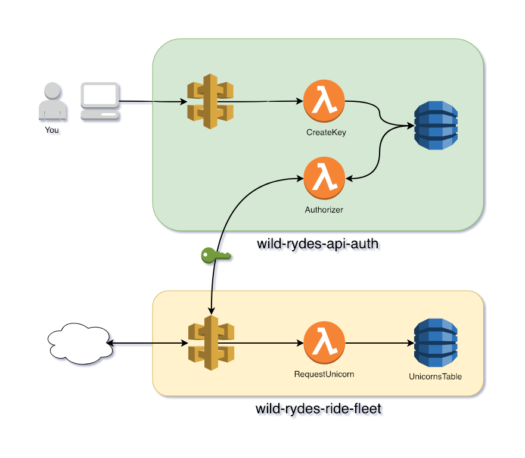
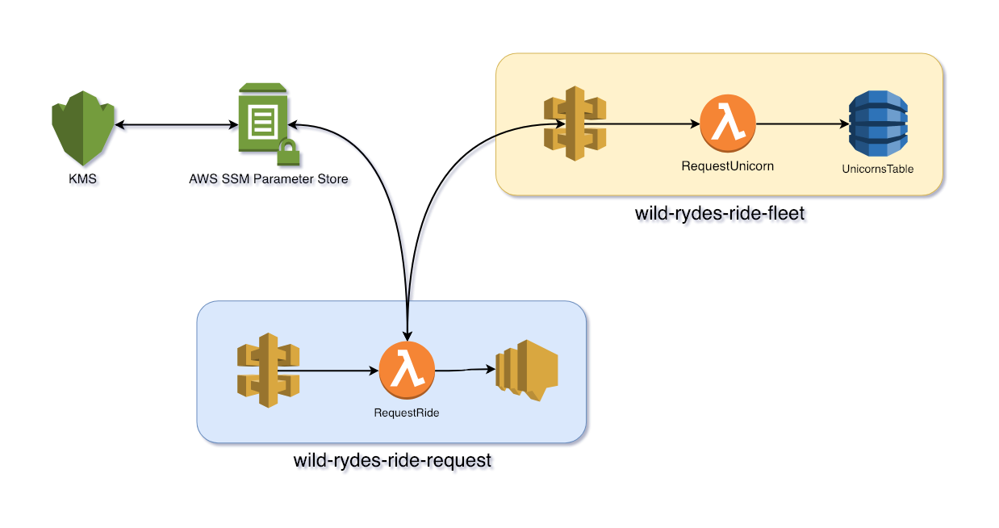

# Serverless Application Security

In this module we'll find and fix application security issues. These are basic application security issues that you will likely encounter and eventually need to solve.

We'll work to find and fix these issues.

## Goals and Objectives:

**Objectives:**
* Understand basic security concerns of serverless.
  * Exposed API endpoints without authorization.
  * Managing application secrets.
  * Vulnerable application dependencies.

**Goals:**

* Add an API Gateway authorizer to secure endpoints
* Secure and manage an API token with AWS SSM Parameter Store
* Find and fix a security vulnerability in a third-party code resource with Snyk

## Application Security
What we'll cover in this module are basic serverless application security issues. These are not highly sophisticated issues. But they are however common issues and technical requirements of serverless applications. These are low hanging fruit that routinely result in information exposure and other security incidents.

### Exposed API Endpoints / API Gateway Authorizers
One common application security issue is publicly exposed APIs that don't require any authorization. This means anyone who can find the endpoint can probe it for data which can result in leaking potentially sensitive information. And it's not uncommon for APIs that are expected to only be consumed internally to not have access controls.

However, unlike an AWS EC2 environment where there is a VPC and security groups that can provide network access controls, API Gateway can be restricted to a VPC but it will not be without extra setup. This means, *you might deploy an API on API Gateway intending it for internal use only but it is publicly exposed to the world while lacking adequate protection.*

In Wild Rydes, none of our API endpoints have any form of authentication (*Am I who I say I am?*) and/or authorization (*Am I allowed to access this?*) checks. We're going to focus on the *wild-rydes-ride-fleet*.

While it is possible to restrict an API Gateway endpoint to a VPC, we're not going to choose that option. Instead we're going to choose to use an API Gateway custom authorizer. A custom authorizer is a Lambda function that when invoked must provide an authentication policy that allows the API endpoint's function to execute.

You'll build out this system workflow in this module.



We've created a simple, **not intended for production usage**, service called *wild-rydes-api-auth*. To make use of this service you will:

* Create an API key for the *wild-rydes-ride-fleet* service.
* Configure the *wild-rydes-ride-fleet* *RequestUnicorn* Lambda function to call the authorizer function
* Update *wild-rydes* to send the API key in the *X-API-Key* header.

This is just one way of using API Gateway custom authorizers or securing an API Gateway endpoint in general. Other alternatives are a Custom Authorizer that calls a service like Auth0 or eschewing a custom authorizer for AWS Cognito.

### Secrets Management / Systems Manager (SSM) Param Store, Secrets Manager, & KMS
The API keys, such as for *wild-rydes-ride-fleet*, passwords, etc. are what we commonly refer to as a "secrets". They are data that we want to control access to because possession of them can grant access to service we want to protect.

AWS provides two services that are suitable secrets such as passwords and API keys.  They are Systems Manager (SSM) Parameter Store and Secrets Manager.

AWS SSM Parameter Store is a general purpose key value store and we've used it in previous training modules, mostly for service discovery. It can be used for secrets management too. We can encrypt the value using a KMS key and control access to the parameter either through controlling access to parameter or access to the KMS key. Best of all, it's free.

Secrets Manager is newer and specifically designed for managing and storing secrets. Encrypting the secret value with a KMS key is not optional. Operations on the secret such as create, fetch, rotate, and delete, are logged via CloudTrail. Also, a secret can also be setup so that it is rotated on a schedule. These are useful features for people with requirements to track access and rotate secrets regularly. Secrets Manager charges a small fee per secret stored and then additional charges based on the number of API calls to the service.

We're going to use SSM Parameter Store over Secrets Manager in this module. This is because the cost difference isn't justified when we lack the need for it's features such as automated secret rotation or secret usage and management logging.



We'll also briefly touch on the KMS service. Many services that support encryption have a default AWS provided KMS key. But, by default all entities (eg. IAM users and roles) can make use of those keys. How secret can something be if everyone has the ability to decrypt it? We've created a KMS key in our account that we are only allowed to encrypt data with by default. We'll grant a Lambda function the ability to use the KMS key to decrypt our API key even though we personally do not have that access. _(Yes, this security is trivial to bypass but with additional layers of security this may prove useful.)_

### Vulnerable Function Dependencies / Snyk
Your Lambda function's code is more than just the code you wrote. It more than likely uses third party libraries or modules. (Even if just from your runtime's standard library.) Unpatched vulnerabilities in third party code is often an issue. In many organizations, physical and virtual hosts may be regularly patched because of operating system vendor bulletins. But at the application level where many libraries do not originate from formal vendors, vulnerabilities often go unpatched. The best practice of specifying application dependency versions, or "pinning", means dependencies are often not updated. When combined with a desire to not introduce stability issues due to new code (*don't fix what isn't broken*) many developers do not regularly update application dependencies.

To solve this issue, a service like Snyk scans code repositories for the dependencies and compares them against the public security announcements provided by many of the package distribution services for different languages. In this module we'll see a vulnerable Python module discovered by Snyk and remediate the issue through an update.

## Instructions
Because of the complexity of many of the steps, unlike other workshop modules, this module will mostly show you the changes to be made. In turn, it will link to documentation and explain why the changes were made the way they were.

### 1. Deploy services

#### wild-rydes-api-auth
Deploy the new *wild-rydes-api-auth* service.

```
$ cd $WORKSHOP
$ git clone https://github.com/ServerlessOpsIO/wild-rydes-api-auth.git
$ cd wild-rydes-data-lake
$ git checkout -b workshop-security-01
$ npm install
$ sls deploy -v
```

This service will create an parameter in AWS SSM Parameter Store called */wild-rydes-api-auth/<USER#>/Arn*. We export the authorizer function's ARN so we can get the ARN for *wild-rydes-ride-fleet*.

#### wild-rydes-ride-fleet
Deploy the new *wild-rydes-ride-fleet* service.

```
$ cd $WORKSHOP/wild-rydes-ride-fleet
$ git clone https://github.com/ServerlessOpsIO/wild-rydes-ride-fleet.git
$ git checkout -b workshop-security-01
$ npm install
$ sls deploy -v
```

#### wild-rydes
Deploy the updated *wild-rydes* service.
```
$ cd $WORKSHOP/wild-rydes
$ git clone https://github.com/ServerlessOpsIO/wild-rydes.git
$ git checkout -b workshop-security-01
$ npm install
$ sls deploy -v
```

### 2. Update wild-rydes-ride-fleet
Update _wild-rydes-ride-fleet_ to to call the *wild-rydes-api-auth* *Authorizer* function when invoking the _RequestUnicorn_ Lambda function. To do this you’ll update the _RequestUnicorn_ function’s HTTP event.

You’ll add an _authorizer_ property to the HTTP trigger event. The new property will define the function authorizer's ARN and the header to pull the API key from. You can just make the change below.

*handlers/get_unicorn.py*
```diff
--- a/serverless.yml
+++ b/serverless.yml
@@ -51,6 +51,9 @@ functions:
       - http:
           path: /unicorn
           method: get
+          authorizer:
+            arn: ${ssm:/wild-rydes-api-auth/${self:provider.stage}/Arn}
+            identitySource: method.request.header.x-api-key

   LoadTable:
     handler: handlers/load_table.handler
```

There’s a bit of variability you can achieve with authorizers and the Serverless Framework documentation covers this here:

* [Serverless Framework: HTTP Endpoints with Custom Authorizers](https://serverless.com/framework/docs/providers/aws/events/apigateway#http-endpoints-with-custom-authorizers)

With your function updated, deploy it.

```
$ sls deploy
```
### 3. Obtain API key for _wild-rydes-ride-fleet_
Generate an API key for _wild-rydes-ride-fleet_ in the _wild-rydes-api-auth_ service.

Start by getting the HTTP endpoint for creating API keys. Do this by running `sls info` in the _wild-rydes-api-auth_ directory and in the output under _endpoints_ look for the endpoint that takes an HTTP POST request. (It should be the first endpoint listed.)

```
$ cd $WORKSHOP/wild-rydes-api-auth
$ sls info
```
<details>
<summary><strong>Output</strong></summary>
<p>
See the example output below. The value you’re looking for in this example output is `https://kbnrvuvmbl.execute-api.us-east-2.amazonaws.com/user0/key`. Make sure to use the value from your own output from `sls info`.


```
Service Information
service: wild-rydes-api-auth
stage: user0
region: us-east-2
stack: wild-rydes-api-auth-user-0
api keys:
  None
endpoints:
  POST - https://kbnrvuvmbl.execute-api.us-east-2.amazonaws.com/user0/key
  PUT - https://kbnrvuvmbl.execute-api.us-east-2.amazonaws.com/user0/key/{id}
  GET - https://kbnrvuvmbl.execute-api.us-east-2.amazonaws.com/user0/key/{id}
  GET - https://kbnrvuvmbl.execute-api.us-east-2.amazonaws.com/user0/key/{id}/{timestamp}
  PUT - https://kbnrvuvmbl.execute-api.us-east-2.amazonaws.com/user0/key/{id}/{timestamp}
  PUT - https://kbnrvuvmbl.execute-api.us-east-2.amazonaws.com/user0/key/{id}/{timestamp}/active
  PUT - https://kbnrvuvmbl.execute-api.us-east-2.amazonaws.com/user0/key/{id}/{timestamp}/inactive
  PUT - https://kbnrvuvmbl.execute-api.us-east-2.amazonaws.com/user0/key/{id}/{timestamp}/ttl
  DELETE - https://kbnrvuvmbl.execute-api.us-east-2.amazonaws.com/user0/key/{id}
  DELETE - https://kbnrvuvmbl.execute-api.us-east-2.amazonaws.com/user0/key/{id}/{timestamp}
functions:
  Authorizer: wild-rydes-api-auth-user0-Authorizer
  CreateKey: wild-rydes-api-auth-user0-CreateKey
  GetKey: wild-rydes-api-auth-user0-GetKey
  UpdateKey: wild-rydes-api-auth-user0-UpdateKey
  DeleteKey: wild-rydes-api-auth-user0-DeleteKey
layers:
  None
```

</p>
</details>

Now make a request to the _wild-rydes-api-auth_ service to generate an API key for _wild-rydes-ride-fleet_. The payload of the request is JSON with the name of the API Gateway for your _wild-rydes-ride-fleet_ service (remember to replace `<USER#>` with your own user number / stage name) and the URL is the URL you just obtained from running `sls info`.
```
curl -X POST --data '{"Id":"<USER#>-wild-rydes-ride-fleet"}' <URL>
```
<details>
<summary><strong>Output</strong></summary>
<p>

```
{
  "Id": "<USER#>-wild-rydes-ride-fleet",
  "Key": "<API_KEY>",
  "DateTime": 1546041232,
  "Active": true,
  "TTL": 0
}
```
</p>
</details>

Make note of the API key you received back. You will need that in steps 4 and 5.

### 4. Request a member of fleet using `curl`

Attempt to use curl to request a ride.

Start by getting an HTTP endpoint for requesting a ride from _wild-rydes-ride-fleet_. Do this by running `sls info` in the _wild-rydes-ride-fleet_ directory. There will only be one endpoint in the _endpoints_ section of the output.

```
$ cd $WORKSHOP/wild-rydes-ride-fleet
$ sls info
```
<details>
<summary><strong>Output</strong></summary>
<p>

```
Service Information
service: wild-rydes-ride-fleet
stage: user0
region: us-east-2
stack: wild-rydes-ride-fleet-user0
api keys:
  None
endpoints:
  GET - https://hhrs2nyo0b.execute-api.us-east-2.amazonaws.com/user0/unicorn
functions:
  RequestUnicorn: wild-rydes-ride-fleet-user0-RequestUnicorn
  LoadTable: wild-rydes-ride-fleet-user0-LoadTable
layers:
  None
```

</p>
</details>

Now make a request to the _wild-rydes-ride-fleet_ service using `curl` with no API key. You should get an access denied error.
```
$ curl <URL>
```
<details>
<summary><strong>Output</strong></summary>
<p>

```
{
  "message": "Unauthorized"
}
```
</p>
</details>


Now make the same request but with the API key you created in step 3. This time your request should succeed.
```
$ curl -H "x-api-key: <API_KEY>" <URL>
```
<details>
<summary><strong>Output</strong></summary>
<p>

```
{
  "DeviceId": "212dee58-f26a-11e8-b171-8c859074f8c7",
  "Name": "Bucephalus",
  "Color": "Golden"
}
```
</p>
</details>

### 5. Securely store API key in SSM Parameter Store

For other services to make use of this API key, store it in SSM Parameter store. Name the key `/wild-rydes-ride-fleet/<USER#>/api_key` where *USER#* is your user number / stage. For example, *user0*. We also want to encrypt the key's value. To do that we'll use a key called *alias/serverlessops/master* which has been created for use in this workshop.

Run the command below, replacing *USER#* and *API_KEY* with your own values.


```
aws ssm put-parameter --name /wild-rydes-ride-fleet/<USER#>/api_key --value <API_KEY> --type SecureString --key-id alias/serverlessops/master
```

<details>
<summary><strong>Output</strong></summary>
<p>

```
{
    "Version": 1
}
```
</p>
</details>

<!-- We can split here if we want to -->

### 6. Update *wild-rydes* to use the *wild-rydes-ride-fleet* API key.
Update *wild-rydes* to obtain the *wild-rydes-ride-fleet* API key and an use it when making requests for fleet members. You'll pass the SSM Parameter Store parameter name, NOT THE PARAMETER VALUE, to the function via an environmental variable. Your function will then fetch the parameter's value from Paramater Store. This is different than what we've done before! In other modules we've Serverless Framework lookup the value at deploy time. But here we want to keep the API key securely encrypted until the function is invoked. For that reason we're going to have the *RequestRide* Lambda function do the parameter value lookup instead of Serverless Framework.

#### Update *wild-rydes* _serverless.yml_
Update the *serverless.yml* file. Below if a diff illustrating the changes to be made.

*serverless.yml*
```diff
--- a/serverless.yml
+++ b/serverless.yml
@@ -11,9 +11,13 @@ custom:
   region: "${opt:region, 'us-east-2'}"
   log_level: "${env:LOG_LEVEL, 'INFO'}"

+  ssm_encryption_key_arn: "${ssm:/infra/kms/prime/alias/serverlessops/master/Arn}"
+
   thundraApiKey: "${ssm:/thundra/root/api-key}"

   request_unicorn_url: "${cf:wild-rydes-ride-fleet-${self:custom.stage}.RequestUnicornUrl}"
+  request_unicorn_api_key_ssm_param: "/wild-rydes-ride-fleet/${self:custom.stage}/api_key"
+
   ride_record_url: "${ssm:/wild-rydes-ride-record/${self:custom.stage}/URL}"

   hostedZoneName: "${ssm:/route53/root/ServerlessOpsDomain}"
@@ -61,6 +65,21 @@ provider:
         - "sns:Publish"
       Resource:
         - Ref: RidesSnsTopic
+    - Effect: "Allow"
+      Action:
+        - "ssm:GetParameter"
+      Resource:
+        - Fn::Join:
+          - ":"
+          - - "arn:aws:ssm"
+            - Ref: AWS::Region
+            - Ref: AWS::AccountId
+            - "parameter${self:custom.request_unicorn_api_key_ssm_param}"
+    - Effect: "Allow"
+      Action:
+        - "kms:Decrypt"
+      Resource:
+        - "${self:custom.ssm_encryption_key_arn}"


 functions:
@@ -72,6 +91,7 @@ functions:
     environment:
       LOG_LEVEL: "${self:custom.log_level}"
       REQUEST_UNICORN_URL: "${self:custom.request_unicorn_url}"
+      REQUEST_UNICORN_API_KEY_SSM_PARAM: "${self:custom.request_unicorn_api_key_ssm_param}"
       RIDES_SNS_TOPIC_ARN:
         Ref: RidesSnsTopic
     events:
```

#### Update the *RequestRide* function handler

Update the *RequestRide* function to obtain the API key from SSM Parameter Store and send it in the *x-api-key* header when making the web request in *_get_unicorn()*. Below if a diff illustrating the changes to be made.

*handlers/request_ride.py*
```diff
--- a/handlers/request_ride.py
+++ b/handlers/request_ride.py
@@ -24,6 +24,11 @@ _logger.addHandler(ThundraLogHandler())

 REQUEST_UNICORN_URL = os.environ.get('REQUEST_UNICORN_URL')

+SSM_CLIENT = boto3.client('ssm')
+REQUEST_UNICORN_API_KEY_SSM_PARAM = os.environ.get('REQUEST_UNICORN_API_KEY_SSM_PARAM')
+REQUEST_UNICORN_API_KEY = SSM_CLIENT.get_parameter(Name=REQUEST_UNICORN_API_KEY_SSM_PARAM, WithDecryption=True)['Parameter']['Value']
+
+
 RIDES_SNS_TOPIC_ARN = os.environ.get('RIDES_SNS_TOPIC_ARN')
 SNS_CLIENT = boto3.client('sns')

@@ -56,9 +61,14 @@ def _get_timestamp_from_uuid(u):


 @Traceable(trace_args=True, trace_return_value=True)
-def _get_unicorn(url=REQUEST_UNICORN_URL):
+def _get_unicorn(url=REQUEST_UNICORN_URL, api_key=REQUEST_UNICORN_API_KEY):
     '''Return a unicorn from the fleet'''
-    unicorn = requests.get(REQUEST_UNICORN_URL)
+    unicorn = requests.get(
+        REQUEST_UNICORN_URL,
+        headers={
+            'x-api-key': REQUEST_UNICORN_API_KEY
+        }
+    )
     return unicorn.json()


```

### 7. Insecure Application Dependency in *wild-rydes*

The wild-rydes service has an application dependency vulnerability. We've been alerted of this issue through [Snyk](https://www.snyk.io) which provides monitoring for application dependency vulnerabilities. Click the link below to be brought to the wild-rydes GitHub repository. (This link brings you to a branch of the repository with the Snyk badge added.)

* https://github.com/ServerlessOpsIO/wild-rydes/tree/workshop-security-02

Now look for and click the [](https://snyk.io/test/github/ServerlessOpsIO/wild-rydes?targetFile=requirements.txt) button to be taken to the vulnerability explanation page. You'll see this issue can leak authentication credentials. (This vulnerability does not affect our current usage though.) Click the *More about this issue* link. The next page explains under the *Remediation* heading that the issue was resolved in release 2.20. Update the requests module in the *requetsts.txt* from version *2.19* to *2.20*.


```diff
--- a/requirements.txt
+++ b/requirements.txt
@@ -1,4 +1,4 @@
 boto3
 cfn_resource
 thundra
-requests==2.19
+requests==2.20
```

## Q&A

### Secrets Management

Q. Our means of passing the API key to the *RequestRide* function is fine except it makes rotating the API key hard. Explain why.

<details>
<summary><strong>Hint</strong></summary>
<p>Notice our function gets the paramater value outside of the function handler.</p>
</details>

<details>
<summary><strong>Answer</strong></summary>
<p>
By getting the value outside of the handler, the value is evaluated only on the first invocation instance. If the API key changes then you will need to redeploy the function to obtain the new key. In the meantime, the function will fail because it is using the old API key.
</p>
</details>

Q. What are the drawbacks of doing the parameter lookup in the Lambda function's handler?

A. This isn't a very fair question because the answers aren't well documented. Parameter Store will throttle API requests at a certain point which can result in your function failing. Additionally, expect a Parameter Store lookup to add about 20-30ms to the duration of every call.

**EXTRA CREDIT** Q. Reduce the number of calls to SSM Parameter Store by using [ssm-cache-python](https://github.com/alexcasalboni/ssm-cache-python) to provide value caching and aging. This helps prevent throttling of API requests and reduces function duration on average.

### API Gateway Authorizers

Q. We used a custom authorizer that invoked a Lambda function of ours to control access to our API. What are two other methods also mentioned in this workshop?

<details>
<summary><strong>Hint</strong></summary>
<p>

* One is an AWS service
* One is a third-party SaaS service.
</p>
</details>

<details>
<summary><strong>Answer</strong></summary>
<p>

* [AWS Cognito](https://aws.amazon.com/cognito/)
* [Auth0](https://auth0.com/)
</p>
</details>

### Application Dependencies

Q. How do you currently stay on top of third party application dependencies? (In particular dependencies not distributed by your OS provider such as Python, NodeJS, etc. dependencies.)

<details>
<summary><strong>Answer</strong></summary>
<p>
If you answered, "we don't", you're not alone. There are scanning services available that can scan your application at build time as well as services for managing application dependencies where security scanning is a feature.

Companies providing some solutions are:

* [Snyk](https://snyk.io/)
* [Sonatype](https://www.sonatype.com/)
* [WhiteSource](https://www.whitesourcesoftware.com/)
</p>
</details>