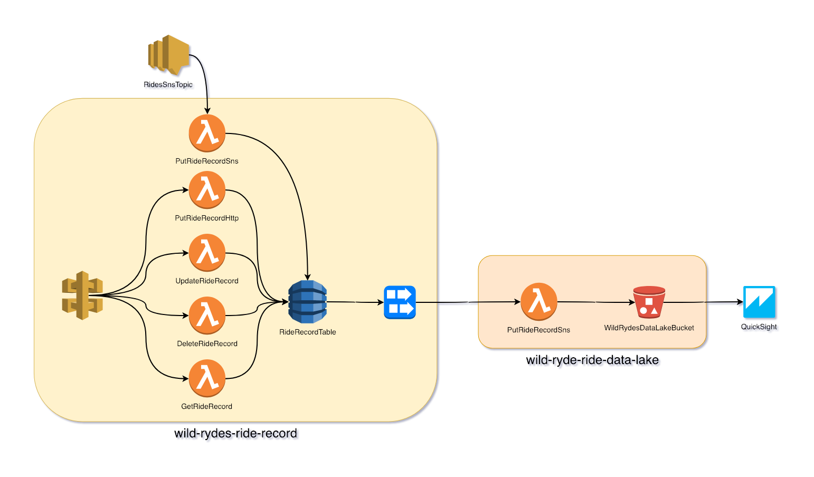

<!--
Good ideas: https://www.puresec.io/blog/aws-security-best-practices-config-rules-lambda-security
-->

# Serverless Infrastructure Security

In this module we'll find and fix infrastructure security issues. We'll find and fix common mistakes in configuration that many people make. Much of this module will revolve around misconfiguration of IAM permissions.

We're going to deploy a new small service called *wild-rydes-data-lake* which takes ride data and places it into an S3 data lake to be used by analysis tools. We've also added functionality to *wild-rydes-ride-record*. Both of these services have securiuty issues we'll address.

## Goals and Objectives:

**Objectives:**
* Understand the basic infrastructure security concerns of serverless
  * Open S3 buckets
  * Wide scoping of resources in IAM policies
  * Wide scoping of IAM actions

**Goals:**
* Properly write an S3 policy so that bucket data is not publicly accessible
* Remove broad access to multiple AWS resources (eg. all dynamoDB tables)
* Create Lambda function roles on a per function basis with the limited actions required


## Infrastructure Security
This lab will primarily deal with AWS access controls. In particular, we will make use of [AWS IAM](https://aws.amazon.com/iam/) to properly secure our application infrastructure. Incorrect or far too broad IAM policies lead to many of the security issues that organizations see. This module will illustrate common mistakes people make and demonstrate best practices. We'll also see an S3 bucket policy used. This is similar to IAM but applies only to S3 buckets

### Access Controls / AWS IAM
The AWS IAM service is the service in AWS that controls access to resources and services in AWS.  We've touched on IAM in other workshop modules as we've granted Lambda functions the ability to perform certain actions on other AWS resources. For example, add an item to a DynamoDB table. So far we've shown you mostly best practices. In this workshop we'll explore some best practices by demonstrating the poorer practices people often employ and how to fix them.

IAM entities can mostly be broken down into users, groups, roles, and policies. We're going to ignore IAM users and groups since they're not relevant to us in this workshop. With our serverless applications we should be most concerned with the following.

* _IAM Policy:_ A collection of IAM permission statements. These statements determine what actions can be performed against what resources. A policy may consist of multiple statements. IAM policies can be attached to an IAM role, group, or user. (Best practice is to not attach policies to users.) 
* _IAM Role:_ An IAM identity that is meant to be assumed by a person (eg. an IAM user) or AWS resource (eg. AWS EC2 instance or Lambda function). IAM roles do not have access keys or passwords. Instead by an identity assuming the role the entity is granted temporary security credentials. For out purposes in this workshop, we configure Lambda functions to assume an IAM Role that gives them permission to access other AWS resources.

With the way Serverless Framework handles IAM policy statements, policies, and roles by default; we'll first concern ourselves with individual IAM policy statements. Later we'll configure Serverless Framework to handle IAM roles differently.

#### Creating an IAM role and policy

Serverless Framework automatically creates an IAM role per service and configures each function to assume that Lambda role. (That's one IAM role in a *serverless.yml* file that all functions in that file will be configured to assume.) Let's demonstrate how we manage IAM with Serverless Framework through example.

We configure I am policy statements via the `provider.iamRoleStatements` property. For example, see the following.

```yaml
provider:
  # NOTE: other provider properties have been removed for clarity.
  iamRoleStatements:
    - Effect: Allow
      Action:
        - dynamodb:PutItem
      Resource:
        Ref: MyDdbTable
    - Effect: Allow
      Action:
        - sqs:SendMessage
      Resource:
        Fn::GetAtt:
          - MySqsDlq
          - Arn

```


There are two policy statements defined in that example. One statement grants the ability to put an item into a specific DynamoDB table.  The second allows send an SQS message to an SQS queue. Each policy statement defines an effect, which is to allow an action (as opposed to deny), an action (as defined by the IAM API), and an AWS resource ARN (we use CloudFormation functions to get the ARN of different resources in our application stack.)

These statements adhere to a general principle to follow when working with IAM, *grant as a few actions to as a few resources as possible.* Commonly this is referred to as "the principle of least privilege".  Not following that is the cause of many security issues in AWS. People don't follow best practices not just because they're lazy or "bad people", they do so because IAM can be complicated. If you don't know what DynamoDB IAM permissions a function needs it's tempting to just write "_dynamodb:*_" and if you're not sure how to get the ARN of a resource through CloudFormation it's tempting to set the resource to "_*_".

The following two links, especially the second one will help you with crafting IAM policies:

* [IAM JSON Policy Reference](https://docs.aws.amazon.com/IAM/latest/UserGuide/reference_policies.html)
* [Actions, Resources, and Condition Keys for AWS Services](https://docs.aws.amazon.com/IAM/latest/UserGuide/reference_policies_actions-resources-contextkeys.html)

While we're here, we've mentioned that Serverless Framework creates a single role that all functions in the service will assume. What if we have functions for not just put, but also get, update, and delete? Every function is going to have those permissions. Even functions that maybe don't have to interact with DynamoDB at all. And what if we have two DynamoDB tables in a service?... You get the picture. We'll use a Serverless Framework plugin called [serverless-iam-roles-per-function](https://www.npmjs.com/package/serverless-iam-roles-per-function) to create multiple functions and allow us to better adhere to the principle of least privilege.

### S3 Bucket Access / S3 Bucket Policies

S3 bucket policies are similar to IAM policies but only apply to S3 buckets. They have their uses such as allowing public access to bucket objects when S3 is used for web hosting or for granting the ability for entities in another AWS account to access a bucket. (There are better ways to solve that.) Unfortunately these often get people into trouble. People create policies that grant access to S3 data by unauthorized people through policy mistakes or simple frustration. We'll cover one such example and fix it.

### Infrastructure Monitoring / AWS Config

Once infrastructure security issues have been detected and remediated there should be a process put in place to prevent the issue from happening again. We'll use [AWS Config](https://aws.amazon.com/config/) to monitor for and alert on issues. The AWS Config service let's you monitor your AWS resources for compliance against AWS pre-defined or your own custom rules.

In this module once we've remediated our bucket access issue we'll deploy Config rules to monitor for public read and public write access using AWS pre-defined rules.

## Tech Stack

These are the two services we will be working with in this module.

### 

### wild-rydes-ride-data-lake

This service takes ride data and deposits it to S3 for analysis.

### wild-rydes-ride-record

The *wild-rydes-ride-data-lake* service will subscribe to the DynamoDB stream from *wild-rydes-ride-recrd* and write data from it to the data lake. (We've updated *wild-rydes-ride-record* tom export the stream's ARN to SSM Parameter Store so *wild-rydes-ride-data-lake* can suvscribe to it.)

## Instructions

### 1. Deploy services
Deploy the services used for this module. You'll deploy an updated *wild-rydes-ride-record* and the new *wild-rydes-ride-ride-data-lake* service.

#### wild-rydes-ride-record
Deploy an updated *wild-rydes-ride-record* service.

```
$ cd $WORKSHOP/wild-rydes-ride-record
$ git clone https://github.com/ServerlessOpsIO/wild-rydes-ride-record.git
$ git checkout -b workshop-security-02
$ npm install
$ sls deploy -v
```

#### wild-rydes-ride-data-lake
Deploy the new *wild-rydes-ride-data-lake* service.

```
$ cd $WORKSHOP
$ git clone https://github.com/ServerlessOpsIO/wild-rydes-ride-data-lake.git
$ cd wild-rydes-ride-data-lake
$ git checkout -b workshop-security-02
$ npm install
$ sls deploy -v
```

### 2. Review and fix security issues

Find and fix the following security issues.

#### S3 bucket access in *wild-rydes-ride-data-lake*
The S3 bucket that ride data is deposited to in *wild-rydes-ride-data-lake* is open to the world and this needs to be fixed. We don't want anyone who manages to figure out our AWS bucket name to have access to all our customer ride data.

Limit access to the bucket while allowing the _WriteRecord_ Lambda function to still write to the bucket.

This is the current S3 bucket policy. It allows anyone to perform any S3 API operation on the S3 bucket and objects within the bucket. _(TIP: When you write policies for S3 buckets keep in mind that some S3 operations are performed on buckets and some are performed on bucket objects. You'll need to specify those as separate resources as we did below.)_

*serverless.yml:*

```yaml
    WildRydesDataLakeBucketPolicy:
      Type: AWS::S3::BucketPolicy
      Properties:
        Bucket:
          Ref: WildRydesDataLakeBucket
        PolicyDocument:
          Statement:
            - Sid: PublicReadGetObject
              # Policy allows actions to be performed
              Effect: Allow
              # Policy applies to any entity
              Principal: '*'
              # Policy covers all S3 API operations
              Action:
                - s3:*
              # Policy covers the following AWS resources
              Resource:
                # Data lake S3 bucket objects
                - Fn::Join:
                  - "/"
                  - - Fn::GetAtt:
                      - WildRydesDataLakeBucket
                      - Arn
                    - "*"
                # Data lake S3 bucket
                - Fn::GetAtt:
                  - WildRydesDataLakeBucket
                  - Arn
```

In this step of the module you will do the following:

1) Remove the S3 bucket policy resource
1) Add an IAM role policy statement that grants the *S3:PutObject* action to the _WriteRecord_ function.

We're removing the bucket policy because it's easier to manage bucket access by granting access to the role that an AWS resource assumes (eg. Lambda function role) then attempting to centrally manage all access in a single policy. Once you've done that, add a `provider.iamRoleStatements` property that grants the _S3:PutObject_ action on objects in the data lake S3 bucket. This is the only API access the _WriteRecord_ Lambda function requires. _(If we start to add functionality at a later point we will grant more actions on an as needed basis.)_

<details>
<summary><strong>Hint 1</strong></summary>
<p>


* [S3 Bucket Policy CloudFormation Resources](FIXME)
* [Serverless Framework iamRoleStatements](FIXME)

</p>
</details>


<details>
<summary><strong>Answers</strong></summary>
<p>

```diff
--- a/serverless.yml
+++ b/serverless.yml
@@ -24,6 +24,17 @@ provider:
   cfnRole: "arn:aws:iam::${env:AWS_ACCOUNT}:role/CloudFormationDeployRole"
   environment:
     LOG_LEVEL: ${self:custom.log_level}
+  iamRoleStatements:
+    - Effect: "Allow"
+      Action:
+        - "S3:PutObject"
+      Resource:
+        Fn::Join:
+          - '/'
+          - - Fn::GetAtt:
+              - WildRydesDataLakeBucket
+              - Arn
+            - '*'
   stackTags:
     x-service: wild-rydes-ride-data-lake
     x-stack: ${self:service}-${self:provider.stage}
@@ -49,26 +60,3 @@ resources:
     WildRydesDataLakeBucket:
       Type: "AWS::S3::Bucket"

-    WildRydesDataLakeBucketPolicy:
-      Type: AWS::S3::BucketPolicy
-      Properties:
-        Bucket:
-          Ref: WildRydesDataLakeBucket
-        PolicyDocument:
-          Statement:
-            - Sid: PublicReadGetObject
-              Effect: Allow
-              Principal: '*'
-              Action:
-                - s3:*
-              Resource:
-                - Fn::Join:
-                  - "/"
-                  - - Fn::GetAtt:
-                      - WildRydesDataLakeBucket
-                      - Arn
-                    - "*"
-                - Fn::GetAtt:
-                  - WildRydesDataLakeBucket
-                  - Arn
-
```
</p>
</details>


#### DynamoDB access in *wild-rydes-ride-record*
The IAM role in *wild-rydes-ride-record* grants item put, get, update, and delete operations to all DynamoDB tables.

*serverless.yml:*

```yaml
provider:
  iamRoleStatements:
    # Policy allows
    - Effect: Allow
      # Item Put, Get, Update, and Delete
      Action:
        - dynamodb:PutItem
        - dynamodb:UpdateItem
        - dynamodb:DeleteItem
        - dynamodb:GetItem
      # On items in any DynamoDB table in our account
      Resource: '*'
```

Update the role so it only grants them to the *RideRecordTable* DynamoDB resource from this service. You can do this by updating the `provider.iamRoleStatements.Resource` property. You want to replace the '*' value with the ARN of the **RideRecordTable** DynamoDB table.

<details>
<summary><strong>Hint 1</strong></summary>
<p>
Use the *Fn::GetAtt* CloudFormation function to get the ARN of *RideRecordTable*. See the following documentation:

* [AWS::DynamoDB::Table - Fn::GetAtt](https://docs.aws.amazon.com/AWSCloudFormation/latest/UserGuide/aws-resource-dynamodb-table.html#w2ab1c21c10c99c14c15b4)
* [Fn::GetAtt](https://docs.aws.amazon.com/AWSCloudFormation/latest/UserGuide/intrinsic-function-reference-getatt.html)
  </p>
  </details>

<details>
<summary><strong>Answer</strong></summary>
<p>

```diff
--- a/serverless.yml
+++ b/serverless.yml
@@ -38,7 +38,10 @@ provider:
         - dynamodb:UpdateItem
         - dynamodb:DeleteItem
         - dynamodb:GetItem
-      Resource: '*'
+      Resource:
+        Fn::GetAtt:
+          - RideRecordTable
+          - Arn
     - Effect: Allow
       Action:
         - sqs:SendMessage
```
</p>
</details>


#### One IAM role per function in *wild-rydes-ride-record*
Serverless Framework, by default, creates a single IAM role for an entire service. That means every function has the same set of permissions and as a result Lambda functions may have unnecessary access to other AWS resources. While we know of no ability to exploit this in our application, it violates the best practice of following the principle of least access.

The [serverless-iam-roles-per-function](https://www.npmjs.com/package/serverless-iam-roles-per-function) Serverless Framework plugin will alter the default behavior and create an IAM role per Lambda function in a service. Using this plugin we can narrow the scope of permissions for each Lambda function. Start by installing the plugin:

```
$ sls plugin install -n serverless-iam-roles-per-function
```

<details>
<summary><strong>Output</strong></summary>
<p>
Serverless: Installing plugin "serverless-iam-roles-per-function@latest" (this might take a few seconds...)
Serverless: Successfully installed "serverless-iam-roles-per-function@latest"
</p>
</details>
With the plugin installed start updating the *serverless.yml* file so each Lambda function has its own IAM role with only the priveleges it needs in order to function. The process involves removing the `provider.iamRoleStatements` property and creating `iamRoleStatement` properties for each Lambda function. (eg. `functions.PutRideRecordHttp.iamRoleStatement`)

Each function should have a role statement or statements that grants only the access the functions needs in order to function. For example, the *PutRideRecordSns* Lambda function only needs to be able to perform *dynamodb:PutItem* on the *RideRecordTable* DynamoDB table and *sqs:SendMessage* on the *PutRideRecordSnsDlq* deadletter SQS queue.

* [serverless-iam-roles-per-function documentation](https://github.com/functionalone/serverless-iam-roles-per-function/blob/master/README.md)

<details>
<summary><strong>Hint 1</strong></summary>
<p>

* PutRideRecordSns
    * Allow *dynamodb:PutItem* on the *RideRecordTable* DynamoDB table
    * Allow *sqs:SendMessage* on the *PutRideRecordSnsDlq* deadletter SQS queue
* PutRideRecordHttp
    * Allow *dynamodb:PutItem* on the *RideRecordTable* DynamoDB table
* UpdateRideRecord
    * Allow *dynamodb:UpdateItem* on the *RideRecordTable* DynamoDB table
* DeleteRideRecord
    * Allow *dynamodb:DeleteItem* on the *RideRecordTable* DynamoDB table
* GetRideRecord
    * Allow *dynamodb:GetItem* on the *RideRecordTable* DynamoDB table
      </p>
      </details>

<details>
<summary><strong>Answer</strong></summary>
<p>

```diff
--- a/serverless.yml
+++ b/serverless.yml
@@ -4,6 +4,7 @@ service: wild-rydes-ride-record
 plugins:
   - serverless-python-requirements
   - serverless-plugin-lambda-dead-letter
+  - serverless-iam-roles-per-function

 custom:
   stage: "${opt:stage, env:SLS_STAGE, 'dev'}"
@@ -31,24 +32,6 @@ provider:
   stackTags:
     x-service: wild-rydes-ride-record
     x-stack: ${self:service}-${self:provider.stage}
-  iamRoleStatements:
-    - Effect: Allow
-      Action:
-        - dynamodb:PutItem
-        - dynamodb:UpdateItem
-        - dynamodb:DeleteItem
-        - dynamodb:GetItem
-      Resource:
-        Fn::GetAtt:
-          - RideRecordTable
-          - Arn
-    - Effect: Allow
-      Action:
-        - sqs:SendMessage
-      Resource:
-        Fn::GetAtt:
-          - PutRideRecordSnsDlq
-          - Arn
 functions:
   PutRideRecordHttp:
@@ -56,6 +39,14 @@ functions:
     description: "Create Ride Record In Table via API Gateway event"
     memorySize: 128
     timeout: 29
+    iamRoleStatements:
+      - Effect: Allow
+        Action:
+          - dynamodb:PutItem
+        Resource:
+          Fn::GetAtt:
+            - RideRecordTable
+            - Arn
     environment:
       DDB_TABLE_NAME:
         Ref: RideRecordTable
@@ -69,6 +60,21 @@ functions:
     description: "Create Ride Record In Table via SNS event"
     memorySize: 128
     timeout: 29
+    iamRoleStatements:
+      - Effect: Allow
+        Action:
+          - dynamodb:PutItem
+        Resource:
+          Fn::GetAtt:
+            - RideRecordTable
+            - Arn
+      - Effect: Allow
+        Action:
+          - sqs:SendMessage
+        Resource:
+          Fn::GetAtt:
+            - PutRideRecordSnsDlq
+            - Arn
     environment:
       DDB_TABLE_NAME:
         Ref: RideRecordTable
@@ -83,6 +89,14 @@ functions:
     description: "Update Ride Record In Table"
     memorySize: 128
     timeout: 29
+    iamRoleStatements:
+      - Effect: Allow
+        Action:
+          - dynamodb:UpdateItem
+        Resource:
+          Fn::GetAtt:
+            - RideRecordTable
+            - Arn
     environment:
       DDB_TABLE_NAME:
         Ref: RideRecordTable
@@ -96,6 +110,14 @@ functions:
     description: "Delete Ride Record In Table"
     memorySize: 128
     timeout: 29
+    iamRoleStatements:
+      - Effect: Allow
+        Action:
+          - dynamodb:DeleteItem
+        Resource:
+          Fn::GetAtt:
+            - RideRecordTable
+            - Arn
     environment:
       DDB_TABLE_NAME:
         Ref: RideRecordTable
@@ -109,6 +131,14 @@ functions:
     description: "Get Ride Record In Table"
     memorySize: 128
     timeout: 29
+    iamRoleStatements:
+      - Effect: Allow
+        Action:
+          - dynamodb:GetItem
+        Resource:
+          Fn::GetAtt:
+            - RideRecordTable
+            - Arn
     environment:
       DDB_TABLE_NAME:
         Ref: RideRecordTable
```
</p>
</details>

### 3. Deploy updated services

Deploy the newly updated services with your fixes.

#### wild-rydes-ride-data-lake

Deploy the updated *wild-rydes-ride-data-lake* service.

```
$ cd $WORKSHOP/wild-rydes-ride-data-lake
$ sls deploy -v
```

#### wild-rydes-ride-record

Deploy the updated *wild-rydes-ride-record*

```
$ cd $WORKSHOP/wild-rydes-ride-record
$ sls deploy -v
```


### 4. Add AWS Config Rules to alert on open buckets and * access in *wild-rydes-data-lake*

Create an [AWS Config](https://aws.amazon.com/config/) rule that will monitor and alert on the presence of open S3 buckets. It isn't enough that we fix this problem. We should also proactively prevent it from happening again. In this step, add AWS Config rules to detect open read and write permissions on the *WildRydesDataLakeBucket* S3 bucket.

_NOTE: We would never create AWS Config rules like this, on a per service basis, because it would become amazingly expensive. Each AWS Config rule, depending on the total number of Config rules in the account, costs between $1.20 and $2.40. You would more typically have a single deployable service with all your rules and those rules would check multiple AWS resources, not just the resources in a single service._

You'll need to refer to the following documentation to complete this step.

- [Cloudfromation AWS::Config::ConfigRule](https://docs.aws.amazon.com/AWSCloudFormation/latest/UserGuide/aws-resource-config-configrule.html)
- [s3-bucket-public-read-prohibited config rule](https://docs.aws.amazon.com/config/latest/developerguide/s3-bucket-public-read-prohibited.html)
- [s3-bucket-public-write-prohibited config rule](https://docs.aws.amazon.com/config/latest/developerguide/s3-bucket-public-write-prohibited.html)


Add two AWS Config rules to *serverless.yml*, one to check for open read access and one to check for open write access. The details listed before will be needed to write these CloudFormation for these rules.

1) S3 public read prohibited:

 * CloudFormation resource name: *S3PublicReadProhibitedConfigRule* 
 * Config rule name: *S3PublicReadProhibitedConfigRule-${self:provider.stage}*
    * Tacking the stage on allows for multiple deployments of this rule.
 * Scope
    * Resource types: *AWS::S3::Bucket*
    * Resource ID: S3 bucket name from *WildRydesDataLakeBucket*. (Use CloudFormation *Ref* function)
 * Rule source
    * Owner: *AWS*
    * Identifier: *S3_BUCKET_PUBLIC_READ_PROHIBITED*

2) S3 public write prohibited:

- CloudFormation resource name: *S3PublicWriteProhibitedConfigRule* 

- Config rule name: S3PublicWriteProhibitedConfigRule-${self:provider.stage}*
  - Tacking the stage on allows for multiple deployments of this rule.
- Scope
  - Resource types: *AWS::S3::Bucket*
  - Resource ID: S3 bucket name from *WildRydesDataLakeBucket*. (Use CloudFormation *Ref* function)
- Rule source
  - Owner: *AWS*
  - Identifier: *S3_BUCKET_PUBLIC_WRITE_PROHIBITED*

<details>
<summary><strong>Answer</strong></summary>
<p>

```diff
--- a/serverless.yml
+++ b/serverless.yml
@@ -60,3 +60,32 @@ resources:
     WildRydesDataLakeBucket:
       Type: "AWS::S3::Bucket"

+    S3PublicReadProhibitedConfigRule:
+      Type: AWS::Config::ConfigRule
+      Properties:
+        ConfigRuleName: "S3PublicReadProhibitedConfigRule-${self:provider.stage}"
+        Description: "Checks that your S3 buckets do not allow public read access. If an S3 bucket policy or bucket ACL allows public read access, the bucket is noncompliant."
+        Scope:
+          ComplianceResourceTypes:
+            - AWS::S3::Bucket
+          ComplianceResourceId:
+            Ref: WildRydesDataLakeBucket
+        Source:
+          Owner: AWS
+          SourceIdentifier: S3_BUCKET_PUBLIC_READ_PROHIBITED
+
+    S3PublicWriteProhibitedConfigRule:
+      Type: AWS::Config::ConfigRule
+      Properties:
+        ConfigRuleName: "S3PublicWriteProhibitedConfigRule-${self:provider.stage}"
+        Description: "Checks that your S3 buckets do not allow public write access. If an S3 bucket policy or bucket ACL allows public write access, the bucket is noncompliant."
+        Scope:
+          ComplianceResourceTypes:
+            - AWS::S3::Bucket
+          ComplianceResourceId:
+            Ref: WildRydesDataLakeBucket
+        Source:
+          Owner: AWS
+          SourceIdentifier: S3_BUCKET_PUBLIC_WRITE_PROHIBITED
+
```

</p>
</details>

Once you've updated the *serverless.yml* file, deploy the updated *wild-rides-ride-data-lake* service.

```
$ sls deploy -v
```

Verify compliance of the *WildRydesDataLakeBucket* S3 bucket using the command line by running the following command. *(CONFIG_RULE_NAME is the value of ConfigRuleName in serverless.yml. eg. S3PublicWriteProhinitedConfigRule-user0)*

```
$ aws configservice get-compliance-details-by-config-rule --config-rule-name <CONFIG_RULE_NAME>
```

<details>
<summary><strong>Output</strong></summary>
<p>

```
{
    "EvaluationResults": [
        {
            "EvaluationResultIdentifier": {
                "EvaluationResultQualifier": {
                    "ConfigRuleName": "S3PublicWriteProhinitedConfigRule-training-dev",
                    "ResourceType": "AWS::S3::Bucket",
                    "ResourceId": "wild-rydes-ride-data-lake-wildrydesdatalakebucket-1jhtjotdqf5bb"
                },
                "OrderingTimestamp": 1547220922.634
            },
            "ComplianceType": "COMPLIANT",
            "ResultRecordedTime": 1547222154.88,
            "ConfigRuleInvokedTime": 1547222154.653
        }
    ]
}
```
</p>
</details>

## Q&A

